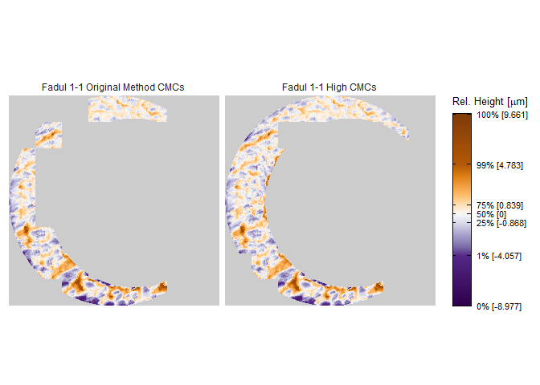

<!-- README.md is generated from README.Rmd. Please edit that file -->

# cmcR

<!-- badges: start -->

[](https://travis-ci.com/jzemmels/cmcR)
[](https://codecov.io/gh/jzemmels/cmcR?branch=master)
<!-- badges: end -->

The cmcR package provides an open-source implementation of the Congruent
Matching Cells method for cartridge case identification as proposed by
[Song
(2013)](https://tsapps.nist.gov/publication/get_pdf.cfm?pub_id=911193)
as well as the “High CMC” method proposed by [Tong et
al. (2015)](https://www.ncbi.nlm.nih.gov/pmc/articles/PMC4730689/pdf/jres.120.008.pdf).

## Installation

<!-- You can install the released version of cmcR from [CRAN](https://CRAN.R-project.org) with: -->

<!-- ``` r -->

<!-- install.packages("cmcR") -->

<!-- ``` -->

Install the development version from
[GitHub](https://github.com/jzemmels/cmcR) with:

``` r
# install.packages("devtools")
devtools::install_github("jzemmels/cmcR")
```

Cartridge case scan data can be accessed at the [NIST Ballisitics and
Toolmarks Research
Database](https://tsapps.nist.gov/NRBTD/Studies/Search)

## Example

We will illustrate the package’s functionality here. This is intended to
be a concise demonstration, so please refer to the package vignettes
available under the “Articles” tab of the [package
website](https://csafe-isu.github.io/cmcR/index.html) for more detailed
information.

``` r
library(cmcR)
library(magrittr)
library(dplyr)
#> 
#> Attaching package: 'dplyr'
#> The following objects are masked from 'package:stats':
#> 
#>     filter, lag
#> The following objects are masked from 'package:base':
#> 
#>     intersect, setdiff, setequal, union
library(ggplot2)
```

Consider the known match cartridge case pair Fadul 1-1 and Fadul 1-2.
The `read_x3p` function from the
[x3ptools](https://github.com/heike/x3ptools) package can read scans
from the [NBTRD](https://tsapps.nist.gov/NRBTD/Studies/Search) given the
appropriate address. The two scans are read below and visualized using
the
[`x3pListPlot`](https://csafe-isu.github.io/cmcR/reference/x3pListPlot.html)
function.

``` r
fadul1.1 <- x3ptools::read_x3p("https://tsapps.nist.gov/NRBTD/Studies/CartridgeMeasurement/DownloadMeasurement/2d9cc51f-6f66-40a0-973a-a9292dbee36d")

fadul1.2 <- x3ptools::read_x3p("https://tsapps.nist.gov/NRBTD/Studies/CartridgeMeasurement/DownloadMeasurement/cb296c98-39f5-46eb-abff-320a2f5568e8")

cmcR::x3pListPlot(list("Fadul 1-1" = fadul1.1,
                       "Fadul 1-2" = fadul1.2),
                  type = "faceted")
```


### Preprocessing

To perform a proper comparison of these two cartridge cases, we need to
remove regions that do not come into uniform or consistent contact with
the breech face of the firearm. These include the small clusters of
pixels in the corners of the two scans, caused by the staging area in
which the scans are taken, and the plateaued region of points around the
firing pin impression hole near the center of the scan. A variety of
processing procedures are implemented in the cmcR package. Functions of
the form `preProcess_*` perform the preprocessing procedures. Consider
the [funtion
reference](https://csafe-isu.github.io/cmcR/reference/index.html) of the
cmcR package for more information regarding these procedures. As is
commonly done when comparing cartridge cases, we first downsample each
scan (by a factor of 4, selecting every other row/column) using the
`sample_x3p` function.

``` r
fadul1.1_processed <- fadul1.1 %>%
  cmcR::preProcess_cropExterior(radiusOffset = -30) %>%
  cmcR::preProcess_filterInterior(radiusOffset = 200) %>%
  cmcR::preProcess_removeTrend() %>%
  cmcR::preProcess_gaussFilter() %>%
  x3ptools::sample_x3p()

fadul1.2_processed <- fadul1.2 %>%
  cmcR::preProcess_cropExterior(radiusOffset = -30) %>%
  cmcR::preProcess_filterInterior(radiusOffset = 200) %>%
  cmcR::preProcess_removeTrend() %>%
  cmcR::preProcess_gaussFilter() %>%
  x3ptools::sample_x3p()

cmcR::x3pListPlot(list("Processed Fadul 1-1" = fadul1.1_processed,
                       "Processed Fadul1-2" = fadul1.2_processed),
                  type = "faceted")
```


### Cell-based comparison procedure

Functions of the form `comparison_*` perform the steps of the cell-based
comparison procedure. The data generated from the cell-based comparison
procedure are kept in a [`tibble`](https://tibble.tidyverse.org/) where
one row represents a single cell/region pairing.

The `comparison_cellDivision` function divides a scan up into a grid of
cells. The `cellIndex` column represents the `row,col` location in the
original scan each cell inhabits. Each cell is stored as an `.x3p`
object in the `cellHeightValues` column. The benefit of using a `tibble`
structure is that processes such as removing rows can be accomplished
using simple `dplyr` commands such as `filter`.

``` r
cellTibble <- fadul1.1_processed %>%
  comparison_cellDivision(numCells = 64)

cellTibble
#> # A tibble: 64 x 2
#>    cellIndex cellHeightValues
#>    <chr>     <named list>    
#>  1 1, 1      <x3p>           
#>  2 1, 2      <x3p>           
#>  3 1, 3      <x3p>           
#>  4 1, 4      <x3p>           
#>  5 1, 5      <x3p>           
#>  6 1, 6      <x3p>           
#>  7 1, 7      <x3p>           
#>  8 1, 8      <x3p>           
#>  9 2, 1      <x3p>           
#> 10 2, 2      <x3p>           
#> # ... with 54 more rows
```

The `comparison_getTargetRegions` function extracts a region from a
target scan (in this case Fadul 1-2) to be paired with each cell in the
reference scan.

``` r
cellTibble <- cellTibble %>%
  mutate(regionHeightValues = comparison_getTargetRegions(cellHeightValues = cellHeightValues,
                                                          target_x3p = fadul1.2_processed))

cellTibble
#> # A tibble: 64 x 3
#>    cellIndex cellHeightValues regionHeightValues
#>    <chr>     <named list>     <named list>      
#>  1 1, 1      <x3p>            <x3p>             
#>  2 1, 2      <x3p>            <x3p>             
#>  3 1, 3      <x3p>            <x3p>             
#>  4 1, 4      <x3p>            <x3p>             
#>  5 1, 5      <x3p>            <x3p>             
#>  6 1, 6      <x3p>            <x3p>             
#>  7 1, 7      <x3p>            <x3p>             
#>  8 1, 8      <x3p>            <x3p>             
#>  9 2, 1      <x3p>            <x3p>             
#> 10 2, 2      <x3p>            <x3p>             
#> # ... with 54 more rows
```

We will want to exclude cells and regions that contain few observations.
The `comparison_calcPropMissing` function calculates the proportion of
missing values in a surface matrix. The call below excludes rows in
which either the cell or region contain more that 85% missing values.

``` r
cellTibble <- cellTibble %>%
  mutate(cellPropMissing = comparison_calcPropMissing(cellHeightValues),
         regionPropMissing = comparison_calcPropMissing(regionHeightValues)) %>%
  filter(cellPropMissing <= .85 & regionPropMissing <= .85)

cellTibble %>%
  select(cellIndex,cellPropMissing,regionPropMissing)
#> # A tibble: 25 x 3
#>    cellIndex cellPropMissing regionPropMissing
#>    <chr>               <dbl>             <dbl>
#>  1 1, 6               0.833              0.808
#>  2 2, 7               0.657              0.700
#>  3 2, 8               0.834              0.757
#>  4 3, 8               0.353              0.638
#>  5 4, 8               0.153              0.576
#>  6 5, 1               0.117              0.767
#>  7 5, 8               0.0441             0.511
#>  8 6, 1               0.305              0.687
#>  9 6, 2               0.368              0.605
#> 10 6, 7               0.243              0.390
#> # ... with 15 more rows
```

We can standardize the surface matrix height values by centering/scaling
by desired functions (e.g., mean and standard deviation). Also, to apply
frequency-domain techniques in comparing each cell and region, the
missing values in each scan need to be replaced. These operations are
performed in the `comparison_standardizeHeightValues` and
`comparison_replaceMissingValues` functions.

Then, the `comparison_fft_ccf` function estimates the translations
required to align the cell and region using the [Cross-Correlation
Theorem](https://mathworld.wolfram.com/Cross-CorrelationTheorem.html).
The `comparison_fft_ccf` function returns a data frame of 3 `x`, `y`,
and `fft_ccf` values: the \(x,y\) estimated translation values at which
the CCF\(_\max\) value is attained between the cell and region. The
`tidyr::unnest` function can unpack the data frame into 3 separate
columns, if desired.

``` r
cellTibble <- cellTibble  %>%
  mutate(cellHeightValues = comparison_standardizeHeights(cellHeightValues),
         regionHeightValues = comparison_standardizeHeights(regionHeightValues)) %>%
  mutate(cellHeightValues_replaced = comparison_replaceMissing(cellHeightValues),
         regionHeightValues_replaced = comparison_replaceMissing(regionHeightValues)) %>%
  mutate(fft_ccf_df = comparison_fft_ccf(cellHeightValues = cellHeightValues_replaced,
                                         regionHeightValues = regionHeightValues_replaced))

cellTibble %>%
  tidyr::unnest(cols = fft_ccf_df) %>%
  select(cellIndex,fft_ccf,x,y)
#> # A tibble: 25 x 4
#>    cellIndex fft_ccf     x     y
#>    <chr>       <dbl> <dbl> <dbl>
#>  1 1, 6        0.244    -7   -23
#>  2 2, 7        0.190    55    31
#>  3 2, 8        0.189    53    53
#>  4 3, 8        0.168   -23   -60
#>  5 4, 8        0.164    -3    13
#>  6 5, 1        0.213   -14   -49
#>  7 5, 8        0.139     7   -48
#>  8 6, 1        0.327   -53   -79
#>  9 6, 2        0.283     8   -45
#> 10 6, 7        0.169    13   -85
#> # ... with 15 more rows
```

Because so many missing values need to be replaced, the CCF\(_{\max}\)
value calculated in the `fft_ccf` column using frequency-domain
techniques is not a very good similarity score (doesn’t differentiate
matches from non-matches well). However, the `x` and `y` estimated
translations are good estimates of the “true” translation values needed
to align the cell and region. To calculate a more accurate similarity
score, we can use the pairwise-complete correlation in which only pairs
of non-missing pixels are considered in the correlation calculation.
This provides a better similarity metric. The pairwise-complete
correlation can be calculated with the `comparison_cor` function.

``` r
cellTibble %>%
  mutate(pairwiseCompCor = comparison_cor(cellHeightValues,regionHeightValues,fft_ccf_df)) %>%
  tidyr::unnest(fft_ccf_df) %>%
  select(cellIndex,x,y,pairwiseCompCor)
#> # A tibble: 25 x 4
#>    cellIndex     x     y pairwiseCompCor
#>    <chr>     <dbl> <dbl>           <dbl>
#>  1 1, 6         -7   -23           0.510
#>  2 2, 7         55    31           0.336
#>  3 2, 8         53    53           0.474
#>  4 3, 8        -23   -60           0.344
#>  5 4, 8         -3    13           0.336
#>  6 5, 1        -14   -49           0.430
#>  7 5, 8          7   -48           0.271
#>  8 6, 1        -53   -79           0.616
#>  9 6, 2          8   -45           0.581
#> 10 6, 7         13   -85           0.453
#> # ... with 15 more rows
```

Finally, this entire comparison procedure is to be repeated over a
number of rotations of the target scan. The resulting data frame below
contains the features that are used in the decision-rule procedure

``` r
cellTibble <- fadul1.1_processed %>%
  comparison_cellDivision(numCells = 64)

comparison_allTogether <- function(reference,target,theta){
  
  reference %>%
    comparison_cellDivision(numCells = 64) %>%
    mutate(regionHeightValues = comparison_getTargetRegions(cellHeightValues = cellHeightValues,
                                                            target_x3p = target,
                                                            regionSizeMultiplier = 9,
                                                            rotation = theta)) %>%
    mutate(cellPropMissing = comparison_calcPropMissing(cellHeightValues),
           regionPropMissing = comparison_calcPropMissing(regionHeightValues)) %>%
    filter(cellPropMissing <= .85 & regionPropMissing <= .85) %>%
    mutate(cellHeightValues = comparison_standardizeHeights(cellHeightValues),
           regionHeightValues = comparison_standardizeHeights(regionHeightValues)) %>%
    mutate(cellHeightValues_replaced = comparison_replaceMissing(cellHeightValues),
           regionHeightValues_replaced = comparison_replaceMissing(regionHeightValues)) %>%
    mutate(fft_ccf_df = comparison_fft_ccf(cellHeightValues = cellHeightValues_replaced,
                                           regionHeightValues = regionHeightValues_replaced)) %>%
    mutate(pairwiseCompCor = comparison_cor(cellHeightValues,regionHeightValues,fft_ccf_df)) %>%
    tidyr::unnest(fft_ccf_df) %>%
    select(cellIndex,x,y,fft_ccf,pairwiseCompCor) %>%
    mutate(theta = theta)
  
}

kmComparisonFeatures <- purrr::map_dfr(seq(-30,30,by = 3),
                                       ~ comparison_allTogether(reference = fadul1.1_processed,
                                                                target = fadul1.2_processed,
                                                                theta = .))

kmComparisonFeatures
#> # A tibble: 527 x 6
#>    cellIndex     x     y fft_ccf pairwiseCompCor theta
#>    <chr>     <dbl> <dbl>   <dbl>           <dbl> <dbl>
#>  1 2, 7        -28   -54   0.196           0.336   -30
#>  2 3, 1        -21    37   0.408           0.732   -30
#>  3 3, 8        -17   -22   0.251           0.503   -30
#>  4 4, 1         -9    35   0.282           0.675   -30
#>  5 4, 8         -8   -26   0.228           0.529   -30
#>  6 5, 1          1    34   0.295           0.561   -30
#>  7 5, 8          0   -22   0.210           0.499   -30
#>  8 6, 1          8    33   0.435           0.765   -30
#>  9 6, 2         65    66   0.279           0.524   -30
#> 10 6, 7          7   -12   0.133           0.328   -30
#> # ... with 517 more rows
```

### Decision rule

The decision rules described in [Song
(2013)](https://tsapps.nist.gov/publication/get_pdf.cfm?pub_id=911193)
and [Tong et
al. (2015)](https://www.ncbi.nlm.nih.gov/pmc/articles/PMC4730689/pdf/jres.120.008.pdf)
are implemented via the `decision_*` functions. The two decision rules
are referred to as the original method of [Song
(2013)](https://tsapps.nist.gov/publication/get_pdf.cfm?pub_id=911193)
and the High CMC method, respectively. Considering the
`kmComparisonFeatures` data frame returned above, we can interpret both
of these decision rules as logic that separates “aberrant” from
“homogeneous” similarity features. The two decision rules principally
differ in how they define an homogeneity.

The original method of [Song
(2013)](https://tsapps.nist.gov/publication/get_pdf.cfm?pub_id=911193)
considers only the similarity features at which the maximum correlation
is attained for each cell across all rotations considered. Since there
is ambiguity in exactly how the correlation is computed in the original
methods, we will consider the features at which specifically the maximum
`pairwiseCompCor` is attained (instead of using the `fft_ccf` column).

``` r
topVotesPerCell <- kmComparisonFeatures %>%
  group_by(cellIndex) %>%
  top_n(n = 1,wt = pairwiseCompCor)

topVotesPerCell
#> # A tibble: 27 x 6
#> # Groups:   cellIndex [27]
#>    cellIndex     x     y fft_ccf pairwiseCompCor theta
#>    <chr>     <dbl> <dbl>   <dbl>           <dbl> <dbl>
#>  1 7, 1         17     9   0.206           0.830   -30
#>  2 7, 4         16    11   0.202           0.617   -30
#>  3 7, 5         16     5   0.193           0.542   -30
#>  4 4, 1         -6    23   0.330           0.722   -27
#>  5 4, 8         -8   -12   0.244           0.600   -27
#>  6 6, 1          3    22   0.441           0.785   -27
#>  7 7, 2          5    18   0.249           0.692   -27
#>  8 7, 7          6    -7   0.349           0.718   -27
#>  9 7, 8         54   -44   0.273           0.824   -27
#> 10 3, 8         -8     4   0.276           0.616   -24
#> # ... with 17 more rows
```

The above set of features can be thought of as the `x`, `y`, and `theta`
“votes” that each cell most strongly “believes” to be the correct
alignment of the entire scan. If a pair is truly matching, we would
expect many of these votes to be similar to each other; indicating that
there is an approximate consensus of the true alignment of the entire
scan (at least, this is the assumption made in [Song
(2013)](https://tsapps.nist.gov/publication/get_pdf.cfm?pub_id=911193)).
In [Song
(2013)](https://tsapps.nist.gov/publication/get_pdf.cfm?pub_id=911193),
the consensus is defined to be the median of the `x`, `y`, and `theta`
values in this `topVotesPerCell` data frame. Cells that are deemed
“close” to these consensus values and that have a “large” correlation
value are declared Congruent Matching Cells (CMCs). Cells with `x`, `y`,
and `theta` values that are within user-defined \(T_x\), \(T_y\), and
\(T_{\theta}\) thresholds of the consensus `x`, `y`, and `theta` values
are considered “close.” If these cells also have a correlation greater
than a user-defined \(T_{\text{CCF}}\) threshold, then they are
considered CMCs. Note that these thresholds are chosen entirely by
experimentation in the CMC literature.

``` r
kmComparison_originalCMCs <- kmComparisonFeatures %>%
  decision_originalMethod_classifyCMCs(corColName = "pairwiseCompCor",
                                       xThresh = 20,
                                       yThresh = 20,
                                       thetaThresh = 6,
                                       corThresh = .5) %>%
  filter(originalMethodClassif == "CMC")

kmComparison_originalCMCs 
#> # A tibble: 16 x 5
#>    cellIndex     x     y pairwiseCompCor originalMethodClassif
#>    <chr>     <dbl> <dbl>           <dbl> <chr>                
#>  1 4, 1         -6    23           0.722 CMC                  
#>  2 4, 8         -8   -12           0.600 CMC                  
#>  3 6, 1          3    22           0.785 CMC                  
#>  4 7, 2          5    18           0.692 CMC                  
#>  5 7, 7          6    -7           0.718 CMC                  
#>  6 3, 8         -8     4           0.616 CMC                  
#>  7 6, 2         -2     9           0.790 CMC                  
#>  8 7, 3         -1     6           0.664 CMC                  
#>  9 8, 3         -1    11           0.671 CMC                  
#> 10 5, 1         -4    -2           0.733 CMC                  
#> 11 5, 8         -7    14           0.631 CMC                  
#> 12 8, 4        -14     4           0.678 CMC                  
#> 13 8, 5        -14     8           0.550 CMC                  
#> 14 8, 6        -13    12           0.675 CMC                  
#> 15 3, 1          7    -9           0.778 CMC                  
#> 16 8, 2          9    -3           0.695 CMC
```

One criticism of the original method of [Song
(2013)](https://tsapps.nist.gov/publication/get_pdf.cfm?pub_id=911193)
is that many cell/region pairs exhibit high correlation values at a
number of rotations. In particular, a cell/region pair may attain a very
high correlation at the “true” theta value, yet attain its maximum
correlation at a theta value far from the consensus theta value. The
original method of [Song
(2013)](https://tsapps.nist.gov/publication/get_pdf.cfm?pub_id=911193)
only considers the “top” vote of each cell/region pairing, so it is not
sensitive to how that cell/region pairing behaves across multiple
rotations.

[Tong et
al. (2015)](https://www.ncbi.nlm.nih.gov/pmc/articles/PMC4730689/pdf/jres.120.008.pdf)
propose a different decision rule procedure that considers the behavior
of cell/region pairings across multiple rotations. This method would
come to be called the High CMC method. The procedure involves computing
a “CMC-\(\theta\)” distribution where for each value of `theta`, the `x`
and `y` values are compared to consensus `x` and `y` values (again, the
median) and the correlation values to a minimum threshold. A cell is
considered a “CMC candidate” (our language, not theirs) at a particular
`theta` value if its `x` and `y` values are within \(T_x\), \(T_y\)
thresholds of the consensus `x` and `y` values and the correlation is at
least as larges as the \(T_{\text{CCF}}\) threshold. This is similar to
the original method of [Song
(2013)](https://tsapps.nist.gov/publication/get_pdf.cfm?pub_id=911193)
except that it relaxes the requirement that the top `theta` value be
close to a consensus. Continuing with the voting analogy, think of this
as an [approval voting
system](https://en.wikipedia.org/wiki/Approval_voting) where each cell
is allowed to vote for multiple `theta` values as long as the `x` and
`y` votes are deemed close to the `theta`-specific `x`,`y` consensuses
and the correlation values are sufficiently high.

The CMC-\(\theta\) distribution consists of the CMC candidates at each
value of `theta`. The assumption made in [Tong et
al. (2015)](https://www.ncbi.nlm.nih.gov/pmc/articles/PMC4730689/pdf/jres.120.008.pdf)
is that, for a truly matching cartridge case pair, a large number of
cells should vote close to the true `theta` alignment value. In their
words, the CMC-\(\theta\) distribution should exhibit a “prominent peak”
close to the rotation at which the two cartridge cases actually align.
Such a prominent peak should not occur for a non-match cartridge case
pair.

The figure below shows an example of a CMC-\(\theta\) distribution
between Fadul 1-1 and Fadul 1-2 constructed using the
`decision_highCMC_cmcThetaDistrib` function. We can clearly see that a
mode is attained around -27 to -24 degrees.

``` r
kmComparisonFeatures %>%
  decision_highCMC_cmcThetaDistrib(corColName = "pairwiseCompCor",
                           xThresh = 20,
                           yThresh = 20,
                           corThresh = .5) %>%
  ggplot(aes(x = theta)) +
  geom_bar(stat = "count",
           alpha = .7) +
  theme_bw() +
  ylab("CMC Candidate Count") +
  xlab(expression(theta))
```


The next step of the High CMC method is to automatically determine if a
mode (i.e., a “prominent peak”) exists in a CMC-\(\theta\) distribution.
If we find a mode, then there is evidence that a “true” rotation exists
to align the two cartridge cases implying the cartridge cases must be
matches (such is the logic employed in [Tong et
al. (2015)](https://www.ncbi.nlm.nih.gov/pmc/articles/PMC4730689/pdf/jres.120.008.pdf)).
To automatically identify a mode, [Tong et
al. (2015)](https://www.ncbi.nlm.nih.gov/pmc/articles/PMC4730689/pdf/jres.120.008.pdf)
propose determining the range of `theta` values with “high” CMC
candidate counts (if this range is small, then there is likely a mode).
They define a “high” CMC candidate count to be
\(CMC_{\text{high}} \equiv CMC_{\max} - \tau\) where \(CMC_{\max}\) is
the maximum value attained in the CMC-\(\theta\) distribution (17 in the
plot shown above) and \(\tau\) is a user-defined constant ([Tong et
al. (2015)](https://www.ncbi.nlm.nih.gov/pmc/articles/PMC4730689/pdf/jres.120.008.pdf)
use \(\tau = 1\)). Any `theta` value with associated an associated CMC
candidate count at least as large as \(CMC_{\text{high}}\) have a “high”
CMC candidate count while any others have a “low” CMC candidate count.

The figure below shows the classification of `theta` values into “High”
and “Low” CMC candidate count groups using the
`decision_highCMC_identifyHighCMCThetas` function. The High CMC count
threshold is shown as a dashed line at \(17 - 1\) CMCs. As expected
since this cartridge case pair is a match, the High CMC count `theta`
values are all close to each other.

``` r
kmComparisonFeatures %>%
  decision_highCMC_cmcThetaDistrib(corColName = "pairwiseCompCor",
                                   xThresh = 20,
                                   yThresh = 20,
                                   corThresh = .5) %>%
  decision_highCMC_identifyHighCMCThetas(tau = 1) %>%
  ggplot() +
  geom_bar(aes(x = theta, fill = thetaCMCIdentif),
           stat = "count",
           alpha = .7) +
  geom_hline(aes(yintercept = max(cmcCandidateCount) - 1),
             linetype = "dashed") +
  scale_fill_manual(values = c("black","gray50")) +
  theme_bw() +
  ylab("CMC Candidate Count") +
  xlab(expression(theta))
```


If the range of High CMC count `theta` values is less than the
user-defined \(T_{\theta}\) threshold, then [Tong et
al. (2015)](https://www.ncbi.nlm.nih.gov/pmc/articles/PMC4730689/pdf/jres.120.008.pdf)
classify all CMC candidates in the identified `theta` mode as actual
CMCs. The `decision_highCMC_classifyCMCs` function classifies CMCs based
on this High CMC criterion. Note that it accepts the output of the
`decision_highCMC_cmcThetaDistrib` function
(`decision_highCMC_identifyHighCMCThetas` is called internally, but is
also exported as a diagnostic tool). Note that a cell may be counted as
a CMC for multiple `theta` values. In these cases, we will only consider
the alignment values at which the cell attained its maximum CCF and was
classified as a CMC. Although it did not occur with this cartridge case
pair, [Tong et
al. (2015)](https://www.ncbi.nlm.nih.gov/pmc/articles/PMC4730689/pdf/jres.120.008.pdf)
propose using the CMC count determined under the original method of
[Song
(2013)](https://tsapps.nist.gov/publication/get_pdf.cfm?pub_id=911193)
if the range of High CMC candidate `theta` values is deemed too large.

``` r
kmComparison_highCMCs <- kmComparisonFeatures %>%
  decision_highCMC_cmcThetaDistrib(corColName = "pairwiseCompCor",
                                   xThresh = 20,
                                   yThresh = 20,
                                   corThresh = .5) %>%
  decision_highCMC_classifyCMCs(tau = 1,thetaThresh = 6) %>%
  group_by(cellIndex) %>%
  filter(highCMCClassif == "CMC") %>%
  filter(pairwiseCompCor == max(pairwiseCompCor))

kmComparison_highCMCs
#> # A tibble: 19 x 6
#> # Groups:   cellIndex [19]
#>    cellIndex     x     y pairwiseCompCor theta highCMCClassif
#>    <chr>     <dbl> <dbl>           <dbl> <dbl> <chr>         
#>  1 4, 1         -6    23           0.722   -27 CMC           
#>  2 4, 8         -8   -12           0.600   -27 CMC           
#>  3 6, 1          3    22           0.785   -27 CMC           
#>  4 7, 2          5    18           0.692   -27 CMC           
#>  5 7, 5          7     7           0.503   -27 CMC           
#>  6 7, 7          6    -7           0.718   -27 CMC           
#>  7 3, 8         -8     4           0.616   -24 CMC           
#>  8 6, 2         -2     9           0.790   -24 CMC           
#>  9 7, 3         -1     6           0.664   -24 CMC           
#> 10 8, 3         -1    11           0.671   -24 CMC           
#> 11 8, 7         -1     0           0.879   -24 CMC           
#> 12 3, 1          1     3           0.776   -21 CMC           
#> 13 5, 1         -4    -2           0.733   -21 CMC           
#> 14 5, 8         -7    14           0.631   -21 CMC           
#> 15 6, 8         -9    18           0.613   -21 CMC           
#> 16 7, 4        -12     5           0.605   -21 CMC           
#> 17 8, 4        -14     4           0.678   -21 CMC           
#> 18 8, 5        -14     8           0.550   -21 CMC           
#> 19 8, 6        -13    12           0.675   -21 CMC
```

The set of CMCs computed above are based on assuming Fadul 1-1 as the
reference scan and Fadul 1-2 as the target scan. [Tong et
al. (2015)](https://www.ncbi.nlm.nih.gov/pmc/articles/PMC4730689/pdf/jres.120.008.pdf)
propose performing the cell-based comparison and decision rule
procedures with the roles reversed and combining the results. They
indicate that if the High CMC method fails to identify a `theta` mode in
the CMC-\(\theta\) distribution, then the minimum of the two CMC counts
computed under the original method of [Song
(2013)](https://tsapps.nist.gov/publication/get_pdf.cfm?pub_id=911193)
should be used as the CMC count (although they don’t detail how to
proceed if a `theta` mode is identified in only one of the two
comparisons).

``` r
kmComparisonFeatures_rev <- purrr::map_dfr(seq(-30,30,by = 3),
                                           ~ comparison_allTogether(reference = fadul1.2_processed,
                                                                    target = fadul1.1_processed,
                                                                    theta = .))

kmComparison_originalCMCs_rev <- kmComparisonFeatures_rev %>%
  decision_originalMethod_classifyCMCs(corColName = "pairwiseCompCor",
                                       xThresh = 20,
                                       yThresh = 20,
                                       thetaThresh = 6,
                                       corThresh = .5)

kmComparison_originalCMCs_rev %>%
  filter(originalMethodClassif == "CMC")
#> # A tibble: 18 x 5
#>    cellIndex     x     y pairwiseCompCor originalMethodClassif
#>    <chr>     <dbl> <dbl>           <dbl> <chr>                
#>  1 4, 1         -1    12           0.826 CMC                  
#>  2 2, 7         -5   -16           0.621 CMC                  
#>  3 5, 1          2    -1           0.810 CMC                  
#>  4 5, 8          7   -19           0.644 CMC                  
#>  5 6, 1          6     1           0.835 CMC                  
#>  6 7, 2          8    -2           0.777 CMC                  
#>  7 2, 8          5    -3           0.678 CMC                  
#>  8 3, 8          4    -4           0.637 CMC                  
#>  9 4, 8          2    -6           0.754 CMC                  
#> 10 6, 2          0   -10           0.714 CMC                  
#> 11 6, 6         -5    -8           0.695 CMC                  
#> 12 7, 3         -1   -10           0.825 CMC                  
#> 13 7, 7         -3    -7           0.604 CMC                  
#> 14 6, 8         -4    10           0.780 CMC                  
#> 15 7, 5        -11    -3           0.678 CMC                  
#> 16 7, 6         -9     1           0.652 CMC                  
#> 17 8, 4        -17    -7           0.695 CMC                  
#> 18 8, 5        -15    -1           0.616 CMC
```

If the High CMC method succeeds in identifying a `theta` mode (again,
it’s unclear whether this means in both directions or only one), then
the CMC counts computed under the High CMC method are combined after
excluding replicates.

``` r
kmComparison_highCMCs_rev <- kmComparisonFeatures_rev %>%
  decision_highCMC_cmcThetaDistrib(corColName = "pairwiseCompCor",
                                   xThresh = 20,
                                   yThresh = 20,
                                   corThresh = .5) %>%
  decision_highCMC_classifyCMCs(tau = 1,thetaThresh = 6) %>%
  group_by(cellIndex) %>%
  filter(highCMCClassif == "CMC") %>%
  filter(pairwiseCompCor == max(pairwiseCompCor))

kmComparison_allHighCMCs <- bind_rows(kmComparison_highCMCs %>%
                                        mutate(direction = "comparison_1to2"),
                                      kmComparison_highCMCs_rev %>%
                                        mutate(direction = "comparison_2to1")) %>%
  group_by(cellIndex) %>%
  filter(pairwiseCompCor == max(pairwiseCompCor))

kmComparison_allHighCMCs
#> # A tibble: 24 x 7
#> # Groups:   cellIndex [24]
#>    cellIndex     x     y pairwiseCompCor theta highCMCClassif direction      
#>    <chr>     <dbl> <dbl>           <dbl> <dbl> <chr>          <chr>          
#>  1 4, 1         -6    23           0.722   -27 CMC            comparison_1to2
#>  2 7, 7          6    -7           0.718   -27 CMC            comparison_1to2
#>  3 6, 2         -2     9           0.790   -24 CMC            comparison_1to2
#>  4 8, 3         -1    11           0.671   -24 CMC            comparison_1to2
#>  5 8, 7         -1     0           0.879   -24 CMC            comparison_1to2
#>  6 3, 1          1     3           0.776   -21 CMC            comparison_1to2
#>  7 7, 4        -12     5           0.605   -21 CMC            comparison_1to2
#>  8 8, 4        -14     4           0.678   -21 CMC            comparison_1to2
#>  9 8, 6        -13    12           0.675   -21 CMC            comparison_1to2
#> 10 2, 7         -5   -16           0.621    21 CMC            comparison_2to1
#> # ... with 14 more rows
```

Finally, we can visualize the regions of the scan identified as CMCs.

``` r
originalMethodCMC_x3p <- x3ptools::df_to_x3p(expand.grid(x = 1:nrow(fadul1.1_processed$surface.matrix),
                                             y = 1:ncol(fadul1.1_processed$surface.matrix)) %>%
                                   mutate(value = NA))

originalMethodCMCs <- fadul1.1_processed %>%
  comparison_cellDivision() %>%
  right_join(kmComparison_originalCMCs,by = "cellIndex") %>%
  pull(cellHeightValues)

for(cell in originalMethodCMCs){
  cellRange <- cell$cmcR.info$cellRange %>%
    stringr::str_extract_all("[0-9]{1,}") %>%
    unlist() %>%
    as.numeric()
  
  originalMethodCMC_x3p$surface.matrix[cellRange[1]:cellRange[2],cellRange[3]:cellRange[4]] <- cell$surface.matrix
}

highCMC_x3p <- x3ptools::df_to_x3p(expand.grid(x = 1:nrow(fadul1.1_processed$surface.matrix),
                                             y = 1:ncol(fadul1.1_processed$surface.matrix)) %>%
                                   mutate(value = NA))

highCMCs <- fadul1.1_processed %>%
  comparison_cellDivision() %>%
  right_join(kmComparison_allHighCMCs,by = "cellIndex") %>%
  pull(cellHeightValues)

for(cell in highCMCs){
  cellRange <- cell$cmcR.info$cellRange %>%
    stringr::str_extract_all("[0-9]{1,}") %>%
    unlist() %>%
    as.numeric()
  
  highCMC_x3p$surface.matrix[cellRange[1]:cellRange[2],cellRange[3]:cellRange[4]] <- cell$surface.matrix
}

x3pListPlot(list("Fadul 1-1 Original Method CMCs" = originalMethodCMC_x3p,
                 "Fadul 1-1 High CMCs" = highCMC_x3p))
```


