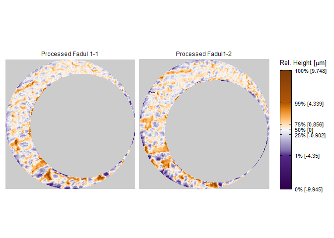
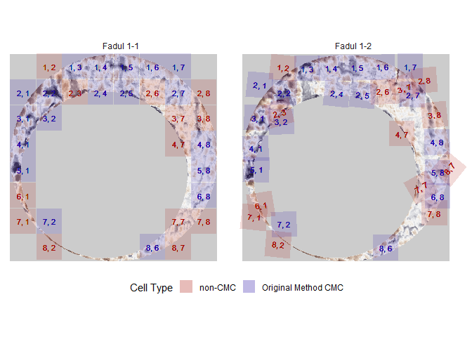
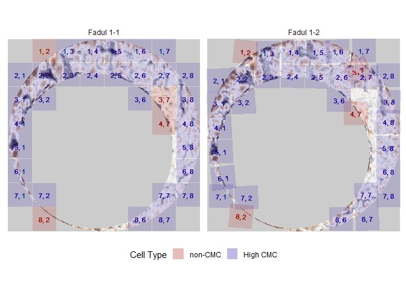

<!-- README.md is generated from README.Rmd. Please edit that file -->

# cmcR

<!-- badges: start -->

[](https://travis-ci.com/jzemmels/cmcR)
[](https://codecov.io/gh/jzemmels/cmcR?branch=master)
<!-- badges: end -->

The cmcR package provides an open-source implementation of the Congruent
Matching Cells method for cartridge case identification as proposed by
[Song
(2013)](https://tsapps.nist.gov/publication/get_pdf.cfm?pub_id=911193)
as well as the “High CMC” method proposed by [Tong et
al. (2015)](https://www.ncbi.nlm.nih.gov/pmc/articles/PMC4730689/pdf/jres.120.008.pdf).

## Installation

<!-- You can install the released version of cmcR from [CRAN](https://CRAN.R-project.org) with: -->

<!-- ``` r -->

<!-- install.packages("cmcR") -->

<!-- ``` -->

Install the development version from
[GitHub](https://github.com/jzemmels/cmcR) with:

``` r
# install.packages("devtools")
devtools::install_github("jzemmels/cmcR")
```

Cartridge case scan data can be accessed at the [NIST Ballisitics and
Toolmarks Research
Database](https://tsapps.nist.gov/NRBTD/Studies/Search)

## Example

We will illustrate the package’s functionality here. This is intended to
be a concise demonstration, so please refer to the package vignettes
available under the “Articles” tab of the [package
website](https://csafe-isu.github.io/cmcR/index.html) for more detailed
information.

``` r
library(cmcR)
library(magrittr)
set.seed(4132020)
```

Consider the known match cartridge case pair Fadul 1-1 and Fadul 1-2.
The `read_x3p` function from the
[x3ptools](https://github.com/heike/x3ptools) package can read scans
from the [NBTRD](https://tsapps.nist.gov/NRBTD/Studies/Search) given the
appropriate address. The two scans are read below and visualized using
the
[`x3pListPlot`](https://csafe-isu.github.io/cmcR/reference/x3pListPlot.html)
function.

``` r
fadul1.1 <- x3ptools::read_x3p("https://tsapps.nist.gov/NRBTD/Studies/CartridgeMeasurement/DownloadMeasurement/2d9cc51f-6f66-40a0-973a-a9292dbee36d")

fadul1.2 <- x3ptools::read_x3p("https://tsapps.nist.gov/NRBTD/Studies/CartridgeMeasurement/DownloadMeasurement/cb296c98-39f5-46eb-abff-320a2f5568e8")

cmcR::x3pListPlot(list("Fadul 1-1" = fadul1.1,
                       "Fadul 1-2" = fadul1.2),
                  type = "faceted")
```


### Preprocessing

To perform a proper comparison of these two cartridge cases, we need to
remove regions that do not come into uniform or consistent contact with
the breech face of the firearm. These include the small clusters of
pixels in the corners of the two scans, caused by the staging area in
which the scans are taken, and the plateaued region of points around the
firing pin impression hole near the center of the scan. A variety of
processing procedures are implemented in the cmcR package. Consider the
[funtion
reference](https://csafe-isu.github.io/cmcR/reference/index.html) of the
cmcR package for more information regarding these procedures. As is
commonly done when comparing cartridge cases, we first downsample each
scan (by a factor of 4, selecting every other row/column) using the
`sample_x3p` function.

``` r
fadul1.1_processed <- fadul1.1 %>%
  cmcR::preProcess_cropBFExterior(radiusOffset = -30) %>%
  cmcR::preProcess_filterBFInterior(radiusOffset = 200) %>%
  cmcR::preProcess_removeBFTrend() %>%
  cmcR::preProcess_gaussFilter() %>%
  x3ptools::sample_x3p()

fadul1.2_processed <- fadul1.2 %>%
  cmcR::preProcess_cropBFExterior(radiusOffset = -30) %>%
  cmcR::preProcess_filterBFInterior(radiusOffset = 200) %>%
  cmcR::preProcess_removeBFTrend() %>%
  cmcR::preProcess_gaussFilter() %>%
  x3ptools::sample_x3p()

cmcR::x3pListPlot(list("Processed Fadul 1-1" = fadul1.1_processed,
                       "Processed Fadul1-2" = fadul1.2_processed),
                  type = "faceted")
```



### Cell-based comparison procedure

Functions of the form `comparison_*` perform the steps of the cell-based
comparison procedure. The data generated from the cell-based comparison
procedure are kept in a [`tibble`](https://tibble.tidyverse.org/) where
one row represents a single cell/region pairing.

The `comparison_cellDivision` function divides a scan up into a grid of
cells. The `cellIndex`, `cellNum`, and `cellRange` detail the location
in the original scan each cell inhabits. Each cell is stored as an
`.x3p` object in the `cellHeightValues` column. The `propMissing` column
indicates the proportion of missing values (`NA`s) in each cell. We will
want to remove cells that contain too many missing values. The benefit
of using a `tibble` structure is that processes such as removing rows
can be accomplished using simple `dplyr` commands such as `filter`.

``` r
cellTibble <- fadul1.1_processed %>%
  comparison_cellDivision(numCells = 64)

cellTibble
#> # A tibble: 64 x 5
#>    cellIndex cellNum cellRange                      cellHeightValues propMissing
#>    <chr>       <int> <chr>                          <list>                 <dbl>
#>  1 1, 1            1 rows: 1 - 69, cols: 1 - 69     <x3p>                  1    
#>  2 1, 2            2 rows: 1 - 69, cols: 70 - 137   <x3p>                  0.899
#>  3 1, 3            3 rows: 1 - 69, cols: 138 - 205  <x3p>                  0.916
#>  4 1, 4            4 rows: 1 - 69, cols: 206 - 273  <x3p>                  0.961
#>  5 1, 5            5 rows: 1 - 69, cols: 274 - 341  <x3p>                  0.936
#>  6 1, 6            6 rows: 1 - 69, cols: 342 - 409  <x3p>                  0.833
#>  7 1, 7            7 rows: 1 - 69, cols: 410 - 477  <x3p>                  0.859
#>  8 1, 8            8 rows: 1 - 69, cols: 478 - 545  <x3p>                  1    
#>  9 2, 1            9 rows: 70 - 137, cols: 1 - 69   <x3p>                  0.835
#> 10 2, 2           10 rows: 70 - 137, cols: 70 - 137 <x3p>                  0.815
#> # ... with 54 more rows
```

The `comparison_getTargetRegions` function extracts a region from a
target scan (in this case Fadul 1-2) to be paired with each cell in the
reference scan. The `regionSizeMultiplier` argument controls how much
larger the region is than its associated cell (without exceeding the
boundaries of the target scan).

``` r
cellTibble <- cellTibble %>%
  dplyr::filter(propMissing <= .85) %>%
  dplyr::mutate(regionHeightValues = comparison_getTargetRegions(cellHeightValues = cellHeightValues,
                                                                 cellRange = cellRange,
                                                                 target_x3p = fadul1.2_processed,
                                                                 regionSizeMultiplier = 9))

cellTibble
#> # A tibble: 29 x 6
#>    cellIndex cellNum cellRange     cellHeightValues propMissing regionHeightVal~
#>    <chr>       <int> <chr>         <list>                 <dbl> <named list>    
#>  1 1, 6            6 rows: 1 - 69~ <x3p>                  0.833 <x3p>           
#>  2 2, 1            9 rows: 70 - 1~ <x3p>                  0.835 <x3p>           
#>  3 2, 2           10 rows: 70 - 1~ <x3p>                  0.815 <x3p>           
#>  4 2, 7           15 rows: 70 - 1~ <x3p>                  0.657 <x3p>           
#>  5 2, 8           16 rows: 70 - 1~ <x3p>                  0.834 <x3p>           
#>  6 3, 1           17 rows: 138 - ~ <x3p>                  0.507 <x3p>           
#>  7 3, 8           24 rows: 138 - ~ <x3p>                  0.353 <x3p>           
#>  8 4, 1           25 rows: 206 - ~ <x3p>                  0.324 <x3p>           
#>  9 4, 8           32 rows: 206 - ~ <x3p>                  0.153 <x3p>           
#> 10 5, 1           33 rows: 274 - ~ <x3p>                  0.117 <x3p>           
#> # ... with 19 more rows
```

We can also standardize the surface matrix height values by
centering/scaling by desired statistics. Also, to apply frequency-domain
techniques in comparing each cell and region, the missing values in each
scan need to be replaced. Both of these operations are performed in the
`comparison_standardizeHeightValues` function. If the replacement of
missing values is desired (i.e., `replaceMissingValues` argument is set
to `TRUE`), then all missing values are replaced with 0 after
centering/scaling. Then, the `comparison_fft.ccf` function estimates the
translations required to align the cell and region using the
[https://mathworld.wolfram.com/Cross-CorrelationTheorem.html](Cross-Correlation%20Theorem).

(Future note: I want the `comparison_fft.ccf` function to create 3 new
columns, corresponding to the x, y, and CCF\(_\max\) values, but I don’t
know how to create 3 columns from a single function call. It’s common in
other languages like Python that if a function returns multiple values
you can declare multiple variable assignments on the same line. I would
like to do something like this with declaring columns, but in a mutate
statement to keep with the tibble theme.)

``` r
cellTibble <- cellTibble %>%
  dplyr::filter(propMissing <= .85) %>%
  dplyr::mutate(regionHeightValues = comparison_getTargetRegions(cellHeightValues = cellHeightValues,
                                                                 cellRange = cellRange,
                                                                 target_x3p = fadul1.2_processed,
                                                                 regionSizeMultiplier = 9))  %>%
  dplyr::mutate(cellHeightValues = comparison_standardizeHeightValues(cellHeightValues,
                                                                      replaceMissingValues = TRUE),
                regionHeightValues = comparison_standardizeHeightValues(regionHeightValues,
                                                                        replaceMissingValues = TRUE)) %>%
  dplyr::mutate(fft.ccf = comparison_fft.ccf(cellHeightValues = cellHeightValues,
                                             regionHeightValues = regionHeightValues))

cellTibble
#> # A tibble: 29 x 7
#>    cellIndex cellNum cellRange cellHeightValues propMissing regionHeightVal~
#>    <chr>       <int> <chr>     <list>                 <dbl> <named list>    
#>  1 1, 6            6 rows: 1 ~ <x3p>                  0.833 <x3p>           
#>  2 2, 1            9 rows: 70~ <x3p>                  0.835 <x3p>           
#>  3 2, 2           10 rows: 70~ <x3p>                  0.815 <x3p>           
#>  4 2, 7           15 rows: 70~ <x3p>                  0.657 <x3p>           
#>  5 2, 8           16 rows: 70~ <x3p>                  0.834 <x3p>           
#>  6 3, 1           17 rows: 13~ <x3p>                  0.507 <x3p>           
#>  7 3, 8           24 rows: 13~ <x3p>                  0.353 <x3p>           
#>  8 4, 1           25 rows: 20~ <x3p>                  0.324 <x3p>           
#>  9 4, 8           32 rows: 20~ <x3p>                  0.153 <x3p>           
#> 10 5, 1           33 rows: 27~ <x3p>                  0.117 <x3p>           
#> # ... with 19 more rows, and 1 more variable: fft.ccf <list>
```

### (OLD) Cell-based comparison procedure

The scans are now ready to be compared using the cell-based comparison
procedure. This is performed using the
[`cellCCF_bothDirections`](https://csafe-isu.github.io/cmcR/reference/cellCCF_bothDirections.html)
function.

``` r
kmComparison <- cmcR::cellCCF_bothDirections(x3p1 = fadul1.1_processed,
                                             x3p2 = fadul1.2_processed,
                                             thetas = seq(-30, 30, by = 3))
```

We may be interested in phase (\(x\),\(y\), and \(\theta\)) at which
each cell/region pair attained the maximum cross-correlation (for
example, this information is used to define matches vs. non-matches
under the original method of Song (2013)). The `topResultsPerCell`
function calculates this information from a list of CCF results (as
returned by the `cellCCF_bothDirections` function) and returns it as a
data frame. As the name implies, `cellCCF_bothDirections` performs the
cell-based comparison procedures in both directions (i.e., Fadul 1-1 is
partitioned into a grid of cells and compared to regions in Fadul 1-2
and vice versa), hence the `$` extraction of the `kmComparison` list
object below. A sample of the output is given below.

``` r
kmComparison$comparison_1to2$ccfResults %>%
  cmcR::topResultsPerCell() %>%
  head()
#> # A tibble: 6 x 8
#> # Groups:   cellRange [6]
#>   cellNum cellRange            fft.ccf    dx    dy theta nonMissingPropor~   ccf
#>     <int> <chr>                  <dbl> <dbl> <dbl> <dbl>             <dbl> <dbl>
#> 1       6 rows: 1 - 69, cols:~   0.262    -7     1   -24             0.167 0.619
#> 2       7 rows: 1 - 69, cols:~   0.245    41    28    27             0.141 0.728
#> 3       2 rows: 1 - 69, cols:~   0.315   -30    22   -30             0.101 0.729
#> 4      17 rows: 138 - 205, co~   0.596    10   -22   -15             0.493 0.818
#> 5      24 rows: 138 - 205, co~   0.323    -8     4   -24             0.647 0.616
#> 6      25 rows: 206 - 273, co~   0.443    -7    23   -27             0.676 0.722
```

### Decision rule

The final step in the CMC methodology is to apply a decision rule to the
features extracted from the cell-based comparison procedure to declare a
cell/region pair “congruent” or not. The number of “congruent”
cell/region pairs is used as a similarity score between the two
cartridge cases considered; the higher the number of congruent
cell/region pairs, the more evidence there is that the cartridge case
pair is a match. The various proposed CMC methods (two of which are
implemented in the cmcR package) differ principally on the decision rule
used to classify “congruent” cells. The
[`cmcFilter_improved`](https://csafe-isu.github.io/cmcR/reference/cmcFilter_improved.html)
function applies the decision rules from the original method of Song
(2013) and the High CMC method of Tong et al. (2015) to the output of
the `cellCCF_bothDirections` function. Phase an correlation thresholds
need to be set by the user.

``` r
kmCMC <- cmcR::cmcFilter_improved(cellCCF_bothDirections_output = kmComparison,
                                  ccf_thresh = .5,
                                  dx_thresh = 20,
                                  theta_thresh = 6)
```

The decision rule of the original method of Song (2013) only considers
one of the two possible comparison directions. As such, we obtain a
congruent matching cell count for both directions. The `comparison_1to2`
direction refers to the case where Fadul 1-1 is partitioned into a grid
of cells and compared to regions in Fadul 1-2.

``` r
nrow(kmCMC$originalMethodCMCs$comparison_1to2)
#> [1] 19
head(kmCMC$originalMethodCMCs$comparison_1to2)
#> # A tibble: 6 x 8
#>   cellNum cellRange            fft.ccf    dx    dy theta nonMissingPropor~   ccf
#>     <int> <chr>                  <dbl> <dbl> <dbl> <dbl>             <dbl> <dbl>
#> 1       6 rows: 1 - 69, cols:~   0.262    -7     1   -24             0.167 0.619
#> 2      24 rows: 138 - 205, co~   0.323    -8     4   -24             0.647 0.616
#> 3      25 rows: 206 - 273, co~   0.443    -7    23   -27             0.676 0.722
#> 4      32 rows: 206 - 273, co~   0.319    -8   -12   -27             0.847 0.600
#> 5      33 rows: 274 - 341, co~   0.431    -5    -2   -21             0.883 0.733
#> 6      40 rows: 274 - 341, co~   0.313    -7    14   -21             0.956 0.631
```

Conversely, the `comparison_2to1` direction refers to Fadul 1-2 is
partitioned into a grid of cells and compared to regions in Fadul 1-1.

``` r
nrow(kmCMC$originalMethodCMCs$comparison_2to1)
#> [1] 20
head(kmCMC$originalMethodCMCs$comparison_2to1)
#> # A tibble: 6 x 8
#>   cellNum cellRange            fft.ccf    dx    dy theta nonMissingPropor~   ccf
#>     <int> <chr>                  <dbl> <dbl> <dbl> <dbl>             <dbl> <dbl>
#> 1       7 rows: 1 - 69, cols:~   0.219    -5   -15    21             0.160 0.695
#> 2      17 rows: 138 - 205, co~   0.396     9   -23    27             0.241 0.762
#> 3      24 rows: 138 - 205, co~   0.388     4    -4    24             0.695 0.637
#> 4      32 rows: 206 - 273, co~   0.487     2    -6    24             0.958 0.754
#> 5      33 rows: 274 - 342, co~   0.459     2    -1    21             0.639 0.810
#> 6      40 rows: 274 - 342, co~   0.476     6   -19    21             0.958 0.644
```

The High CMC method of Tong et al. (2015) applies more stringent
criteria to classify congruent vs. non-congruent matching cells.
However, it also tends to assign a higher CMC count than original method
of Song (2013). Such is the case in the example considered.

``` r
nrow(kmCMC$highCMCs)
#> [1] 29
head(kmCMC$highCMCs)
#> # A tibble: 6 x 9
#>   cellNum cellRange  fft.ccf    dx    dy nonMissingPropo~   ccf theta comparison
#>     <int> <chr>        <dbl> <dbl> <dbl>            <dbl> <dbl> <dbl> <chr>     
#> 1      55 rows: 410~   0.451     6    -7            0.940 0.718   -27 compariso~
#> 2       6 rows: 1 -~   0.262    -7     1            0.167 0.619   -24 compariso~
#> 3       9 rows: 70 ~   0.540    -7     9            0.165 0.900   -24 compariso~
#> 4      56 rows: 410~   0.420    -3     3            0.162 0.785   -24 compariso~
#> 5      59 rows: 478~   0.408    -1    11            0.701 0.671   -24 compariso~
#> 6      63 rows: 478~   0.506    -1     0            0.162 0.879   -24 compariso~
```

We can visualize the congruent matching cells for the comparison
considered using the
[cmcPlot](https://csafe-isu.github.io/cmcR/reference/cmcPlot.html)
function. Tong et al. (2015) recommend using the minimum of the two CMC
counts determined under the original method of Song (2013) as the
“initial” CMC count before applying the High CMC method criteria. This
is what is visualized below.

``` r
cmcPlots <- cmcR::cmcPlot(x3p1 = fadul1.1_processed,
                          x3p2 = fadul1.2_processed,
                          cellCCF_bothDirections_output = kmComparison,
                          cmcFilter_improved_output = kmCMC,
                          x3pNames = c("Fadul 1-1","Fadul 1-2"),
                          #arguments dictating output colors:
                          height.colors = colorspace::desaturate(c('#7f3b08','#b35806',
                                                                   '#e08214','#fdb863',
                                                                   '#fee0b6','#f7f7f7',
                                                                   '#d8daeb','#b2abd2',
                                                                   '#8073ac','#542788',
                                                                   '#2d004b'),
                                                                 amount = .75),
                          cell.colors = c("#a60b00","#1b03a3"),
                          cell.alpha = .15,
                          na.value = "gray80")

cmcPlots$originalMethodCMCs
```



``` r
cmcPlots$highCMCs
```


