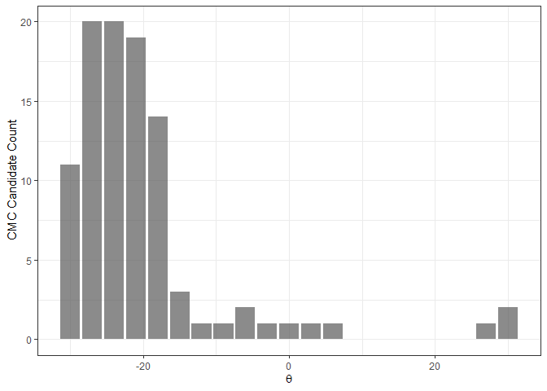

<!-- README.md is generated from README.Rmd. Please edit that file -->

# cmcR

<!-- badges: start -->

[](https://travis-ci.com/jzemmels/cmcR)
[](https://codecov.io/gh/jzemmels/cmcR?branch=master)
<!-- badges: end -->

The cmcR package provides an open-source implementation of the Congruent
Matching Cells method for cartridge case identification as proposed by
[Song
(2013)](https://tsapps.nist.gov/publication/get_pdf.cfm?pub_id=911193)
as well as the “High CMC” method proposed by [Tong et
al. (2015)](https://www.ncbi.nlm.nih.gov/pmc/articles/PMC4730689/pdf/jres.120.008.pdf).

## Installation

<!-- You can install the released version of cmcR from [CRAN](https://CRAN.R-project.org) with: -->

<!-- ``` r -->

<!-- install.packages("cmcR") -->

<!-- ``` -->

Install the development version from
[GitHub](https://github.com/jzemmels/cmcR) with:

``` r
# install.packages("devtools")
devtools::install_github("jzemmels/cmcR")
```

Cartridge case scan data can be accessed at the [NIST Ballisitics and
Toolmarks Research
Database](https://tsapps.nist.gov/NRBTD/Studies/Search)

## Example

We will illustrate the package functionality here. This intended to be a
concise demonstration, so please refer to the package vignettes
available under the “Articles” tab of the [package
website](https://csafe-isu.github.io/cmcR/index.html) for more detailed
information.

``` r
library(cmcR)
library(magrittr)
set.seed(4132020)
```

Consider the known match cartridge case pair Fadul 1-1 and Fadul 1-2.
The `read_x3p` function from the
[x3ptools](https://github.com/heike/x3ptools) package can read scans
from the [NBTRD](https://tsapps.nist.gov/NRBTD/Studies/Search) given the
appropriate address. The two scans are read below and visualized using
the
[`x3pListPlot`](https://csafe-isu.github.io/cmcR/reference/x3pListPlot.html)
function.

``` r
fadul1.1 <- x3ptools::read_x3p("https://tsapps.nist.gov/NRBTD/Studies/CartridgeMeasurement/DownloadMeasurement/2d9cc51f-6f66-40a0-973a-a9292dbee36d")

fadul1.2 <- x3ptools::read_x3p("https://tsapps.nist.gov/NRBTD/Studies/CartridgeMeasurement/DownloadMeasurement/cb296c98-39f5-46eb-abff-320a2f5568e8")

cmcR::x3pListPlot(list("Fadul 1-1" = fadul1.1,
                       "Fadul 1-2" = fadul1.2),
                  type = "faceted")
```


### Preprocessing

To perform a proper comparison of these two cartridge cases, we need to
remove regions that do not come into uniform or consistent contact with
the breech face of the firearm. These include the small clusters of
pixels in the corners of the two scans, caused by the staging area in
which the scans are taken, and the plateaued region of points around the
firing pin impression hole near the center of the scan. A variety of
processing procedures are implemented in the cmcR package. Consider the
[funtion
reference](https://csafe-isu.github.io/cmcR/reference/index.html) of the
cmcR package for more information regarding these procedures. As is
commonly done when comparing cartridge cases, we first downsample each
scan (by a factor of 4, selecting every other row/column) using the
`sample_x3p` function.

``` r
fadul1.1_processed <- x3ptools::sample_x3p(fadul1.1)

fadul1.1_processed$surface.matrix<- fadul1.1_processed$surface.matrix %>%
  cmcR::preProcess_ransac() %>%
  cmcR::preProcess_levelBF() %>%
  cmcR::preProcess_cropWS() %>%
  cmcR::preProcess_removeFPCircle() %>%
  cmcR::preProcess_gaussFilter(res = fadul1.1_processed$header.info$incrementY)

fadul1.2_processed <- x3ptools::sample_x3p(fadul1.2)

fadul1.2_processed$surface.matrix<- fadul1.2_processed$surface.matrix %>%
  cmcR::preProcess_ransac() %>%
  cmcR::preProcess_levelBF() %>%
  cmcR::preProcess_cropWS() %>%
  cmcR::preProcess_removeFPCircle() %>%
  cmcR::preProcess_gaussFilter(res = fadul1.2_processed$header.info$incrementY)

#manually update scan metadata processing
fadul1.1_processed$header.info$sizeY <- ncol(fadul1.1_processed$surface.matrix)
fadul1.1_processed$header.info$sizeX <- nrow(fadul1.1_processed$surface.matrix)

fadul1.2_processed$header.info$sizeY <- ncol(fadul1.2_processed$surface.matrix)
fadul1.2_processed$header.info$sizeX <- nrow(fadul1.2_processed$surface.matrix)

cmcR::x3pListPlot(list("Processed Fadul 1-1" = fadul1.1_processed,
                       "Processed Fadul1-2" = fadul1.2_processed),
                  type = "faceted")
```


### Cell-based comparison procedure

The scans are now ready to be compared using the cell-based comparison
procedure. This is performed using the
[`cellCCF_bothDirections`](https://csafe-isu.github.io/cmcR/reference/cellCCF_bothDirections.html)
function.

``` r
kmComparison <- cmcR::cellCCF_bothDirections(x3p1 = fadul1.1_processed,
                                             x3p2 = fadul1.2_processed,
                                             thetas = seq(-30, 30, by = 3))
```

We may be interested in phase (\(x\),\(y\), and \(\theta\)) at which
each cell/region pair attained the maximum cross-correlation (for
example, this information is used to define matches vs. non-matches
under the original method of Song (2013)). The `topResultsPerCell`
function calculates this information from a list of CCF results (as
returned by the `cellCCF_bothDirections` function) and returns it as a
data frame. As the name implies, `cellCCF_bothDirections` performs the
cell-based comparison procedures in both directions (i.e., Fadul 1-1 is
partitioned into a grid of cells and compared to regions in Fadul 1-2
and vice versa), hence the `$` extraction of the `kmComparison` list
object below. A sample of the output is given below.

``` r
kmComparison$comparison_1to2$ccfResults %>%
  cmcR::topResultsPerCell() %>%
  head()
#> # A tibble: 6 x 8
#> # Groups:   cellID [6]
#>   cellNum cellID              fft.ccf    dx    dy theta nonMissingProport~   ccf
#>     <int> <chr>                 <dbl> <dbl> <dbl> <dbl>              <dbl> <dbl>
#> 1       3 y = 1 - 73, x = 14~   0.469     4    -2   -30              0.512 0.640
#> 2       4 y = 1 - 73, x = 21~   0.253   -28     6   -27              0.496 0.537
#> 3       5 y = 1 - 73, x = 29~   0.274    -7   -24    -3              0.525 0.503
#> 4       6 y = 1 - 73, x = 36~   0.252    12     6    27              0.604 0.563
#> 5       7 y = 1 - 73, x = 43~   0.258   -30   -22    21              0.125 0.783
#> 6       2 y = 1 - 73, x = 74~   0.322    19   -19     9              0.149 0.855
```

### Decision rule

The final step in the CMC methodology is to apply a decision rule to the
features extracted from the cell-based comparison procedure to declare a
cell/region pair “congruent” or not. The number of “congruent”
cell/region pairs is used as a similarity score between the two
cartridge cases considered; the higher the number of congruent
cell/region pairs, the more evidence there is that the cartridge case
pair is a match. The various proposed CMC methods (two of which are
implemented in the cmcR package) differ principally on the decision rule
used to classify “congruent” cells. The
[`cmcFilter_improved`](https://csafe-isu.github.io/cmcR/reference/cmcFilter_improved.html)
function applies the decision rules from the original method of Song
(2013) and the High CMC method of Tong et al. (2015) to the output of
the `cellCCF_bothDirections` function. Phase an correlation thresholds
need to be set by the user.

``` r
kmCMC <- cmcR::cmcFilter_improved(cellCCF_bothDirections_output = kmComparison,
                                  ccf_thresh = .5,
                                  dx_thresh = 20,
                                  theta_thresh = 6)
```

The decision rule of the original method of Song (2013) only considers
one of the two possible comparison directions. As such, we obtain a
congruent matching cell count for both directions. The `comparison_1to2`
direction refers to the case where Fadul 1-1 is partitioned into a grid
of cells and compared to regions in Fadul 1-2.

``` r
nrow(kmCMC$originalMethodCMCs$comparison_1to2)
#> [1] 17
head(kmCMC$originalMethodCMCs$comparison_1to2)
#> # A tibble: 6 x 8
#>   cellNum cellID              fft.ccf    dx    dy theta nonMissingProport~   ccf
#>     <int> <chr>                 <dbl> <dbl> <dbl> <dbl>              <dbl> <dbl>
#> 1      17 y = 146 - 218, x =~   0.386     1   -10   -18              0.618 0.896
#> 2      25 y = 219 - 290, x =~   0.320    -7    12   -24              0.893 0.701
#> 3      32 y = 219 - 290, x =~   0.216    -7     3   -24              0.880 0.633
#> 4      33 y = 291 - 362, x =~   0.335    -6     0   -21              0.916 0.722
#> 5      34 y = 291 - 362, x =~   0.314   -10    -1   -21              0.377 0.661
#> 6      46 y = 363 - 435, x =~   0.308   -14    17   -21              0.481 0.860
```

Conversely, the `comparison_2to1` direction refers to Fadul 1-2 is
partitioned into a grid of cells and compared to regions in Fadul 1-1.
The CMC counts we obtain are similar for both directions.

``` r
nrow(kmCMC$originalMethodCMCs$comparison_2to1)
#> [1] 8
head(kmCMC$originalMethodCMCs$comparison_2to1)
#> # A tibble: 6 x 8
#>   cellNum cellID              fft.ccf    dx    dy theta nonMissingProport~   ccf
#>     <int> <chr>                 <dbl> <dbl> <dbl> <dbl>              <dbl> <dbl>
#> 1       6 y = 1 - 73, x = 36~   0.244   -17   -14    12              0.631 0.533
#> 2      17 y = 147 - 219, x =~   0.492    -2     5    21              0.588 0.829
#> 3      43 y = 366 - 438, x =~   0.319    16     2    18              0.200 0.777
#> 4      55 y = 439 - 511, x =~   0.353   -12    20     9              0.894 0.602
#> 5      50 y = 439 - 511, x =~   0.355     6     0    21              0.912 0.685
#> 6      14 y = 74 - 146, x = ~   0.447   -12    -8     9              0.345 0.839
```

The High CMC method of Tong et al. (2015) applies more stringent
criteria to classify congruent vs. non-congruent matching cells.
However, it also tends to assign a higher CMC count than original method
of Song (2013). Such is the case in the example considered.

``` r
nrow(kmCMC$highCMCs)
#> [1] 40
head(kmCMC$highCMCs)
#> # A tibble: 6 x 9
#>   cellNum cellID    fft.ccf    dx    dy nonMissingPropor~   ccf theta comparison
#>     <int> <chr>       <dbl> <dbl> <dbl>             <dbl> <dbl> <dbl> <chr>     
#> 1      18 y = 146 ~   0.483   -15    22             0.194 0.815   -27 compariso~
#> 2      47 y = 363 ~   0.297   -19    22             0.978 0.515   -27 compariso~
#> 3      52 y = 436 ~   0.259     5     8             0.947 0.642   -27 compariso~
#> 4      60 y = 508 ~   0.270    10    -1             0.920 0.600   -27 compariso~
#> 5      62 y = 508 ~   0.484    10    -7             0.658 0.692   -27 compariso~
#> 6       4 y = 1 - ~   0.304   -15     7             0.496 0.523   -24 compariso~
```

We can visualize the congruent matching cells for the comparison
considered using the
[cmcPlot](https://csafe-isu.github.io/cmcR/reference/cmcPlot.html)
function. Tong et al. (2015) recommend using the minimum of the two CMC
counts determined under the original method of Song (2013) as the
“initial” CMC count before applying the High CMC method criteria. This
is what is visualized below.

``` r
cmcPlots <- cmcR::cmcPlot(x3p1 = fadul1.1_processed,
                          x3p2 = fadul1.2_processed,
                          cellCCF_bothDirections_output = kmComparison,
                          cmcFilter_improved_output = kmCMC,
                          #arguments dictating output colors:
                          height.colors = colorspace::desaturate(c('#7f3b08','#b35806',
                                                                   '#e08214','#fdb863',
                                                                   '#fee0b6','#f7f7f7',
                                                                   '#d8daeb','#b2abd2',
                                                                   '#8073ac','#542788',
                                                                   '#2d004b'),
                                                                 amount = .75),
                          cell.colors = c("#a60b00","#1b03a3"),
                          cell.alpha = .15,
                          na.value = "gray80")

cmcPlots$originalMethodCMCs
```


``` r
cmcPlots$highCMCs
```


