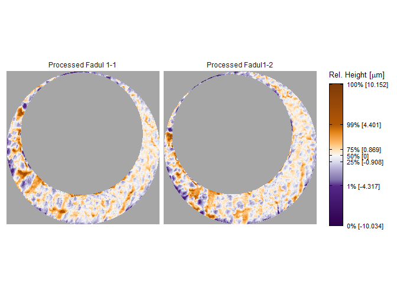
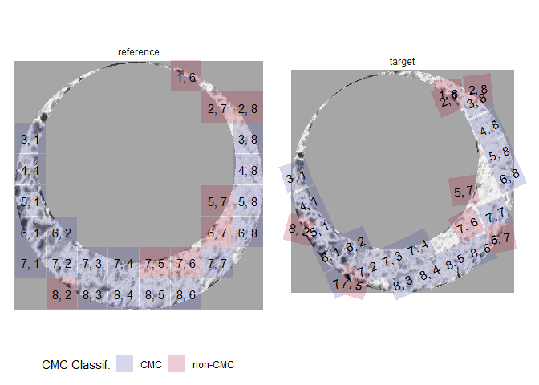

<!-- README.md is generated from README.Rmd. Please edit that file -->

# cmcR

<!-- badges: start -->

[](https://app.codecov.io/gh/CSAFE-ISU/cmcR?branch=master/)
[](https://github.com/CSAFE-ISU/cmcR/actions/)
<!-- badges: end -->

The cmcR package provides an open-source implementation of the Congruent
Matching Cells method for cartridge case identification as proposed by
[Song
(2013)](https://tsapps.nist.gov/publication/get_pdf.cfm?pub_id=911193)
as well as the “High CMC” method proposed by [Tong et
al. (2015)](https://www.ncbi.nlm.nih.gov/pmc/articles/PMC4730689/pdf/jres.120.008.pdf).

## Installation

<!-- You can install the released version of cmcR from [CRAN](https://CRAN.R-project.org) with: -->
<!-- ``` r -->
<!-- install.packages("cmcR") -->
<!-- ``` -->

Install the development version from
[GitHub](https://github.com/CSAFE-ISU/cmcR) with:

``` r
# install.packages("devtools")
devtools::install_github("jzemmels/cmcR")
```

Cartridge case scan data can be accessed at the [NIST Ballisitics
Toolmark Research
Database](https://tsapps.nist.gov/NRBTD/Studies/Search)

## Example

We will illustrate the package’s functionality here. Please refer to the
package vignettes available under the “Articles” tab of the [package
website](https://csafe-isu.github.io/cmcR/index.html) for more
information.

``` r
library(cmcR)
library(magrittr)
library(dplyr)
library(ggplot2)
library(x3ptools)
```

Consider the known match cartridge case pair Fadul 1-1 and Fadul 1-2.
The `read_x3p` function from the
[x3ptools](https://github.com/heike/x3ptools) package can read scans
from the [NBTRD](https://tsapps.nist.gov/NRBTD/Studies/Search) given the
appropriate address. The two scans are read below and visualized using
the
[`x3pListPlot`](https://csafe-isu.github.io/cmcR/reference/x3pListPlot.html)
function.

``` r
fadul1.1_id <- "DownloadMeasurement/2d9cc51f-6f66-40a0-973a-a9292dbee36d"
# Same source comparison
fadul1.2_id <- "DownloadMeasurement/cb296c98-39f5-46eb-abff-320a2f5568e8"

# Code to download breech face impressions:
nbtrd_url <- "https://tsapps.nist.gov/NRBTD/Studies/CartridgeMeasurement/"

fadul1.1_raw <- x3p_read(paste0(nbtrd_url,fadul1.1_id)) %>%
  x3ptools::x3p_scale_unit(scale_by = 1e6)
fadul1.2_raw <- x3p_read(paste0(nbtrd_url,fadul1.2_id)) %>%
  x3ptools::x3p_scale_unit(scale_by = 1e6)

x3pListPlot(list("Fadul 1-1" = fadul1.1_raw,
                 "Fadul 1-2" = fadul1.2_raw),
            type = "faceted")
```


### Preprocessing

To perform a proper comparison of these two cartridge cases, we need to
remove regions that do not come into uniform or consistent contact with
the breech face of the firearm. These include the small clusters of
pixels in the corners of the two scans from the microscope staging area,
and the plateaued region of points around the firing pin impression hole
near the center of the scan. A variety of processing procedures are
implemented in the cmcR package. Functions of the form `preProcess_*`
perform the preprocessing procedures. See the [funtion
reference](https://csafe-isu.github.io/cmcR/reference/index.html) of the
cmcR package for more information regarding these procedures. As is
commonly done when comparing cartridge cases, we downsample each scan
(by a factor of 4, selecting every other row/column) using the
`sample_x3p` function.

``` r
fadul1.1_processed <- fadul1.1_raw %>%
  preProcess_crop(region = "exterior",offset = -30) %>%
  preProcess_crop(region = "interior",offset = 200) %>%
  preProcess_removeTrend(statistic = "quantile",
                         tau = .5,
                         method = "fn") %>%
  preProcess_gaussFilter() %>%
  x3ptools::x3p_sample()

fadul1.2_processed <- fadul1.2_raw %>%
  preProcess_crop(region = "exterior",offset = -30) %>%
  preProcess_crop(region = "interior",offset = 200) %>%
  preProcess_removeTrend(statistic = "quantile",
                         tau = .5,
                         method = "fn") %>%
  preProcess_gaussFilter() %>%
  x3ptools::x3p_sample()

x3pListPlot(list("Processed Fadul 1-1" = fadul1.1_processed,
                 "Processed Fadul1-2" = fadul1.2_processed),
            type = "faceted")
```



### Cell-based comparison procedure

Functions of the form `comparison_*` perform the steps of the cell-based
comparison procedure. The data generated from the cell-based comparison
procedure are kept in a [`tibble`](https://tibble.tidyverse.org/) where
one row represents a single cell/region pairing.

The `comparison_cellDivision` function divides a scan up into a grid of
cells. The `cellIndex` column represents the `row,col` location in the
original scan each cell inhabits. Each cell is stored as an `.x3p`
object in the `cellHeightValues` column. The benefit of using a `tibble`
structure is that processes such as removing rows can be accomplished
using simple `dplyr` commands such as `filter`.

``` r
cellTibble <- fadul1.1_processed %>%
  comparison_cellDivision(numCells = c(8,8))

cellTibble
#> # A tibble: 64 x 2
#>    cellIndex cellHeightValues
#>    <chr>     <named list>    
#>  1 1, 1      <x3p>           
#>  2 1, 2      <x3p>           
#>  3 1, 3      <x3p>           
#>  4 1, 4      <x3p>           
#>  5 1, 5      <x3p>           
#>  6 1, 6      <x3p>           
#>  7 1, 7      <x3p>           
#>  8 1, 8      <x3p>           
#>  9 2, 1      <x3p>           
#> 10 2, 2      <x3p>           
#> # ... with 54 more rows
```

The `comparison_getTargetRegions` function extracts a region from a
target scan (in this case Fadul 1-2) to be paired with each cell in the
reference scan.

``` r
cellTibble <- cellTibble %>%
  mutate(regionHeightValues = comparison_getTargetRegions(cellHeightValues = cellHeightValues,
                                                          target = fadul1.2_processed))

cellTibble
#> # A tibble: 64 x 3
#>    cellIndex cellHeightValues regionHeightValues
#>    <chr>     <named list>     <named list>      
#>  1 1, 1      <x3p>            <x3p>             
#>  2 1, 2      <x3p>            <x3p>             
#>  3 1, 3      <x3p>            <x3p>             
#>  4 1, 4      <x3p>            <x3p>             
#>  5 1, 5      <x3p>            <x3p>             
#>  6 1, 6      <x3p>            <x3p>             
#>  7 1, 7      <x3p>            <x3p>             
#>  8 1, 8      <x3p>            <x3p>             
#>  9 2, 1      <x3p>            <x3p>             
#> 10 2, 2      <x3p>            <x3p>             
#> # ... with 54 more rows
```

We want to exclude cells and regions that are mostly missing from the
scan. The `comparison_calcPropMissing` function calculates the
proportion of missing values in a surface matrix. The call below
excludes rows in which either the cell or region contain more that 85%
missing values.

``` r
cellTibble <- cellTibble %>%
  mutate(cellPropMissing = comparison_calcPropMissing(cellHeightValues),
         regionPropMissing = comparison_calcPropMissing(regionHeightValues)) %>%
  filter(cellPropMissing <= .85 & regionPropMissing <= .85)

cellTibble %>%
  select(cellIndex,cellPropMissing,regionPropMissing)
#> # A tibble: 24 x 3
#>    cellIndex cellPropMissing regionPropMissing
#>    <chr>               <dbl>             <dbl>
#>  1 1, 6               0.809              0.805
#>  2 2, 7               0.624              0.699
#>  3 2, 8               0.846              0.756
#>  4 3, 8               0.343              0.632
#>  5 4, 8               0.130              0.568
#>  6 5, 1               0.108              0.765
#>  7 5, 7               0.829              0.481
#>  8 5, 8               0.0522             0.508
#>  9 6, 1               0.314              0.689
#> 10 6, 2               0.340              0.602
#> # ... with 14 more rows
```

We can standardize the surface matrix height values by centering/scaling
by desired functions (e.g., mean and standard deviation). Also, to apply
frequency-domain techniques in comparing each cell and region, the
missing values in each scan need to be replaced. These operations are
performed in the `comparison_standardizeHeightValues` and
`comparison_replaceMissingValues` functions.

Then, the `comparison_fft_ccf` function estimates the translations
required to align the cell and region using the [Cross-Correlation
Theorem](https://mathworld.wolfram.com/Cross-CorrelationTheorem.html).
The `comparison_fft_ccf` function returns a data frame of 3 `x`, `y`,
and `fft_ccf` values: the

estimated translation values at which the
CCF
value is attained between the cell and region. The `tidyr::unnest`
function can unpack the data frame into 3 separate columns, if desired.

``` r
cellTibble <- cellTibble  %>%
  mutate(cellHeightValues = comparison_standardizeHeights(cellHeightValues),
         regionHeightValues = comparison_standardizeHeights(regionHeightValues)) %>%
  mutate(cellHeightValues_replaced = comparison_replaceMissing(cellHeightValues),
         regionHeightValues_replaced = comparison_replaceMissing(regionHeightValues)) %>%
  mutate(fft_ccf_df = comparison_fft_ccf(cellHeightValues = cellHeightValues_replaced,
                                         regionHeightValues = regionHeightValues_replaced))

cellTibble %>%
  tidyr::unnest(cols = fft_ccf_df) %>%
  select(cellIndex,fft_ccf,x,y)
#> # A tibble: 24 x 4
#>    cellIndex fft_ccf     x     y
#>    <chr>       <dbl> <dbl> <dbl>
#>  1 1, 6        0.242    -6   -24
#>  2 2, 7        0.184    55    32
#>  3 2, 8        0.213    53    54
#>  4 3, 8        0.158   -22   -60
#>  5 4, 8        0.176    -2    13
#>  6 5, 1        0.211   -15   -47
#>  7 5, 7        0.117    21    16
#>  8 5, 8        0.166     8   -48
#>  9 6, 1        0.322   -56   -78
#> 10 6, 2        0.272     8   -46
#> # ... with 14 more rows
```

Because so many missing values need to be replaced, the
CCF
value calculated in the `fft_ccf` column using frequency-domain
techniques is not a very good similarity score (doesn’t differentiate
matches from non-matches well). However, the `x` and `y` estimated
translations are good estimates of the “true” translation values needed
to align the cell and region. To calculate a more accurate similarity
score, we can use the pairwise-complete correlation in which only pairs
of non-missing pixels are considered in the correlation calculation. To
calculate this the `comparison_alignedTargetCell` function takes the
cell, region, and CCF-based alignment information and returns a matrix
of the same dimension as the reference cell representing the sub-matrix
of the target region that the cell aligned to. We can then calculate the
pairwise-complete correlation as shown below.

``` r
cellTibble %>%
  dplyr::mutate(alignedTargetCell = comparison_alignedTargetCell(cellHeightValues = .data$cellHeightValues,
                                                                   regionHeightValues = .data$regionHeightValues,
                                                                   target = fadul1.2_processed,
                                                                   theta = 0,
                                                                   fft_ccf_df = .data$fft_ccf_df)) %>%
    dplyr::mutate(pairwiseCompCor = purrr::map2_dbl(.data$cellHeightValues,.data$alignedTargetCell,
                                             ~ cor(c(.x$surface.matrix),c(.y$surface.matrix),
                                                   use = "pairwise.complete.obs"))) %>%
    tidyr::unnest(.data$fft_ccf_df) %>%
  select(cellIndex,x,y,pairwiseCompCor)
#> # A tibble: 24 x 4
#>    cellIndex     x     y pairwiseCompCor
#>    <chr>     <dbl> <dbl>           <dbl>
#>  1 1, 6         -6   -24           0.558
#>  2 2, 7         55    32           0.377
#>  3 2, 8         53    54           0.751
#>  4 3, 8        -22   -60           0.373
#>  5 4, 8         -2    13           0.420
#>  6 5, 1        -15   -47           0.449
#>  7 5, 7         21    16           0.511
#>  8 5, 8          8   -48           0.355
#>  9 6, 1        -56   -78           0.590
#> 10 6, 2          8   -46           0.555
#> # ... with 14 more rows
```

Finally, this entire comparison procedure is to be repeated over a
number of rotations of the target scan. The entire cell-based comparison
procedure is wrapped in the `comparison_allTogether` function. The
resulting data frame below contains the features that are used in the
decision-rule procedure

``` r
kmComparisonFeatures <- purrr::map_dfr(seq(-30,30,by = 3),
                                       ~ comparison_allTogether(reference = fadul1.1_processed,
                                                                target = fadul1.2_processed,
                                                                
                                                                theta = .,
                                                                returnX3Ps = TRUE))

kmComparisonFeatures %>%
  arrange(theta,cellIndex)
#> # A tibble: 506 x 11
#>    cellIndex     x     y fft_ccf pairwiseCompCor theta refMissingCount
#>    <chr>     <dbl> <dbl>   <dbl>           <dbl> <dbl>           <dbl>
#>  1 2, 7        -28   -54   0.203           0.399   -30            2970
#>  2 3, 1        -22    38   0.414           0.778   -30            2301
#>  3 3, 8        -17   -21   0.255           0.612   -30            1584
#>  4 4, 1        -11    35   0.287           0.756   -30            1467
#>  5 4, 8         -8   -25   0.230           0.656   -30             610
#>  6 5, 1         -1    35   0.300           0.677   -30             516
#>  7 5, 7          2    19   0.113           0.479   -30            3946
#>  8 5, 8          1   -22   0.227           0.599   -30             245
#>  9 6, 1          7    34   0.433           0.793   -30            1475
#> 10 6, 2         10    28   0.282           0.801   -30            1594
#> # ... with 496 more rows, and 4 more variables: targMissingCount <dbl>,
#> #   jointlyMissing <dbl>, cellHeightValues <named list>,
#> #   alignedTargetCell <named list>
```

### Decision rule

The decision rules described in [Song
(2013)](https://tsapps.nist.gov/publication/get_pdf.cfm?pub_id=911193)
and [Tong et
al. (2015)](https://www.ncbi.nlm.nih.gov/pmc/articles/PMC4730689/pdf/jres.120.008.pdf)
are implemented via the `decision_*` functions. We refer to the two
decision rules as the original method of [Song
(2013)](https://tsapps.nist.gov/publication/get_pdf.cfm?pub_id=911193)
and the High CMC method, respectively. Considering the
`kmComparisonFeatures` data frame returned above, we can interpret both
of these decision rules as logic that separates “aberrant” from
“homogeneous” similarity features. The two decision rules principally
differ in how they define an homogeneity.

The original method of [Song
(2013)](https://tsapps.nist.gov/publication/get_pdf.cfm?pub_id=911193)
considers only the similarity features at which the maximum correlation
is attained for each cell across all rotations considered. Since there
is ambiguity in exactly how the correlation is computed in the original
methods, we will consider the features at which specifically the maximum
`pairwiseCompCor` is attained (instead of using the `fft_ccf` column).

``` r
kmComparisonFeatures %>%
  group_by(cellIndex) %>%
  top_n(n = 1,wt = pairwiseCompCor)
#> # A tibble: 26 x 11
#> # Groups:   cellIndex [26]
#>    cellIndex     x     y fft_ccf pairwiseCompCor theta refMissingCount
#>    <chr>     <dbl> <dbl>   <dbl>           <dbl> <dbl>           <dbl>
#>  1 7, 6         21    -1   0.147           0.471   -30             341
#>  2 4, 8         -7   -12   0.246           0.702   -27             610
#>  3 7, 4          7    10   0.215           0.721   -27            1908
#>  4 8, 5         10     6   0.247           0.603   -27             244
#>  5 2, 7        -14   -33   0.228           0.432   -24            2970
#>  6 3, 8         -7     5   0.277           0.699   -24            1584
#>  7 4, 1         -4    11   0.375           0.850   -24            1467
#>  8 5, 1         -4    11   0.363           0.852   -24             516
#>  9 6, 1         -3    11   0.437           0.832   -24            1475
#> 10 6, 2         -1    10   0.302           0.849   -24            1594
#> # ... with 16 more rows, and 4 more variables: targMissingCount <dbl>,
#> #   jointlyMissing <dbl>, cellHeightValues <named list>,
#> #   alignedTargetCell <named list>
```

The above set of features can be thought of as the `x`, `y`, and `theta`
“votes” that each cell most strongly “believes” to be the correct
alignment of the entire scan. If a pair is truly matching, we would
expect many of these votes to be similar to each other; indicating that
there is an approximate consensus of the true alignment of the entire
scan (at least, this is the assumption made in [Song
(2013)](https://tsapps.nist.gov/publication/get_pdf.cfm?pub_id=911193)).
In [Song
(2013)](https://tsapps.nist.gov/publication/get_pdf.cfm?pub_id=911193),
the consensus is defined to be the median of the `x`, `y`, and `theta`
values in this `topVotesPerCell` data frame. Cells that are deemed
“close” to these consensus values and that have a “large” correlation
value are declared Congruent Matching Cells (CMCs). Cells with `x`, `y`,
and `theta` values that are within user-defined
,
,
and

thresholds of the consensus `x`, `y`, and `theta` values are considered
“close.” If these cells also have a correlation greater than a
user-defined

threshold, then they are considered CMCs. Note that these thresholds are
chosen entirely by experimentation in the CMC literature.

``` r
kmComparison_originalCMCs <- kmComparisonFeatures %>%
  mutate(originalMethodClassif = decision_CMC(cellIndex = cellIndex,
                                              x = x,
                                              y = y,
                                              theta = theta,
                                              corr = pairwiseCompCor,
                                              xThresh = 20,
                                              yThresh = 20,
                                              thetaThresh = 6,
                                              corrThresh = .5))

kmComparison_originalCMCs %>%
  filter(originalMethodClassif == "CMC")
#> # A tibble: 18 x 12
#>    cellIndex     x     y fft_ccf pairwiseCompCor theta refMissingCount
#>    <chr>     <dbl> <dbl>   <dbl>           <dbl> <dbl>           <dbl>
#>  1 4, 8         -7   -12   0.246           0.702   -27             610
#>  2 7, 4          7    10   0.215           0.721   -27            1908
#>  3 8, 5         10     6   0.247           0.603   -27             244
#>  4 3, 8         -7     5   0.277           0.699   -24            1584
#>  5 4, 1         -4    11   0.375           0.850   -24            1467
#>  6 5, 1         -4    11   0.363           0.852   -24             516
#>  7 6, 1         -3    11   0.437           0.832   -24            1475
#>  8 6, 2         -1    10   0.302           0.849   -24            1594
#>  9 6, 8         -4     7   0.324           0.787   -24            1475
#> 10 7, 1         -4     8   0.172           0.771   -24            4026
#> 11 7, 2         -2    10   0.253           0.768   -24             305
#> 12 7, 3         -1     7   0.199           0.736   -24             572
#> 13 7, 7         -3     3   0.366           0.829   -24             331
#> 14 8, 3         -1    12   0.279           0.747   -24            1447
#> 15 8, 4         -2     8   0.247           0.738   -24             235
#> 16 5, 8         -6    14   0.254           0.717   -21             245
#> 17 8, 6        -13    13   0.283           0.705   -21            1475
#> 18 3, 1          5    -9   0.516           0.855   -18            2301
#> # ... with 5 more variables: targMissingCount <dbl>, jointlyMissing <dbl>,
#> #   cellHeightValues <named list>, alignedTargetCell <named list>,
#> #   originalMethodClassif <chr>
```

Many have pointed out that there tends to be many cell/region pairs that
exhibit high correlation other than at the “true” rotation (theta)
value.  
In particular, a cell/region pair may attain a very high correlation at
the “true” theta value, yet attain its maximum correlation at a theta
value far from the consensus theta value. The original method of [Song
(2013)](https://tsapps.nist.gov/publication/get_pdf.cfm?pub_id=911193)
is quite sensitive to this behavior. The original method of [Song
(2013)](https://tsapps.nist.gov/publication/get_pdf.cfm?pub_id=911193)
only considers the “top” vote of each cell/region pairing, so it is not
sensitive to how that cell/region pairing behaves across multiple
rotations.

[Tong et
al. (2015)](https://www.ncbi.nlm.nih.gov/pmc/articles/PMC4730689/pdf/jres.120.008.pdf)
propose a different decision rule procedure that considers the behavior
of cell/region pairings across multiple rotations. This method would
come to be called the High CMC method. The procedure involves computing
a “CMC-`theta`” distribution where for each value of `theta`, the `x`
and `y` values are compared to consensus `x` and `y` values (again, the
median) and the correlation values to a minimum threshold. A cell is
considered a “CMC candidate” (our language, not theirs) at a particular
`theta` value if its `x` and `y` values are within
,

thresholds of the consensus `x` and `y` values and the correlation is at
least as larges as the

threshold. This is similar to the original method of [Song
(2013)](https://tsapps.nist.gov/publication/get_pdf.cfm?pub_id=911193)
except that it relaxes the requirement that the top `theta` value be
close to a consensus. Continuing with the voting analogy, think of this
as an [approval voting
system](https://en.wikipedia.org/wiki/Approval_voting) where each cell
is allowed to vote for multiple `theta` values as long as the `x` and
`y` votes are deemed close to the `theta`-specific `x`,`y` consensuses
and the correlation values are sufficiently high.

The CMC-`theta` distribution consists of the “CMC candidates” at each
value of `theta`. The assumption made in [Tong et
al. (2015)](https://www.ncbi.nlm.nih.gov/pmc/articles/PMC4730689/pdf/jres.120.008.pdf)
is that, for a truly matching cartridge case pair, a large number of CMC
candidates should be concentrated around true `theta` alignment value.
In their words, the CMC-`theta` distribution should exhibit a “prominent
peak” close to the rotation at which the two cartridge cases actually
align. Such a prominent peak should not occur for a non-match cartridge
case pair.

The figure below shows an example of a CMC-`theta` distribution between
Fadul 1-1 and Fadul 1-2 constructed using the
`decision_highCMC_cmcThetaDistrib` function. We can clearly see that a
mode is attained around -24 degrees.

``` r
kmComparisonFeatures %>%
  mutate(cmcThetaDistribClassif = decision_highCMC_cmcThetaDistrib(cellIndex = cellIndex,
                                                                   x = x,
                                                                   y = y,
                                                                   theta = theta,
                                                                   corr = pairwiseCompCor,
                                                                   xThresh = 20,
                                                                   yThresh = 20,
                                                                   corrThresh = .5)) %>%
  filter(cmcThetaDistribClassif == "CMC Candidate") %>%
  ggplot(aes(x = theta)) +
  geom_bar(stat = "count",
           alpha = .7) +
  theme_bw() +
  ylab("CMC Candidate Count") +
  xlab(expression(theta))
```


The next step of the High CMC method is to automatically determine if a
mode (i.e., a “prominent peak”) exists in a CMC-`theta` distribution. If
we find a mode, then there is evidence that a “true” rotation exists to
align the two cartridge cases implying the cartridge cases must be
matches (such is the logic employed in [Tong et
al. (2015)](https://www.ncbi.nlm.nih.gov/pmc/articles/PMC4730689/pdf/jres.120.008.pdf)).
To automatically identify a mode, [Tong et
al. (2015)](https://www.ncbi.nlm.nih.gov/pmc/articles/PMC4730689/pdf/jres.120.008.pdf)
propose determining the range of `theta` values with “high” CMC
candidate counts (if this range is small, then there is likely a mode).
They define a “high” CMC candidate count to be

where

is the maximum value attained in the CMC-`theta` distribution (17 in the
plot shown above) and

is a user-defined constant ([Tong et
al. (2015)](https://www.ncbi.nlm.nih.gov/pmc/articles/PMC4730689/pdf/jres.120.008.pdf)
use
).
Any `theta` value with associated an associated CMC candidate count at
least as large as

have a “high” CMC candidate count while any others have a “low” CMC
candidate count.

The figure below shows the classification of `theta` values into “High”
and “Low” CMC candidate count groups using the
`decision_highCMC_identifyHighCMCThetas` function. The High CMC count
threshold is shown as a dashed line at

CMCs.

``` r
kmComparisonFeatures %>%
  mutate(cmcThetaDistribClassif = decision_highCMC_cmcThetaDistrib(cellIndex = cellIndex,
                                                                   x = x,
                                                                   y = y,
                                                                   theta = theta,
                                                                   corr = pairwiseCompCor,
                                                                   xThresh = 20,
                                                                   yThresh = 20,
                                                                   corrThresh = .5)) %>%
  decision_highCMC_identifyHighCMCThetas(tau = 1) %>%
  filter(cmcThetaDistribClassif == "CMC Candidate") %>%
  ggplot() +
  geom_bar(aes(x = theta, fill = thetaCMCIdentif),
           stat = "count",
           alpha = .7) +
  geom_hline(aes(yintercept = max(cmcCandidateCount) - 1),
             linetype = "dashed") +
  scale_fill_manual(values = c("black","gray50")) +
  theme_bw() +
  ylab("CMC Candidate Count") +
  xlab(expression(theta))
```


If the range of High CMC count `theta` values is less than the
user-defined

threshold, then [Tong et
al. (2015)](https://www.ncbi.nlm.nih.gov/pmc/articles/PMC4730689/pdf/jres.120.008.pdf)
classify all CMC candidates in the identified `theta` mode as actual
CMCs.

The `decision_CMC` function classifies CMCs based on this High CMC
criterion if a value for `tau` is given. Note that it internally calls
the `decision_highCMC_cmcThetaDistrib` and
`decision_highCMC_identifyHighCMCThetas` functions (although they are
exported as diagnostic tools). A cell may be counted as a CMC for
multiple `theta` values. In these cases, we will only consider the
alignment values at which the cell attained its maximum CCF and was
classified as a CMC. If the cartridge case pair “fails” the High CMC
criterion (i.e., the range of High CMC candidate `theta` values is
deemed too large), every cell will be classified as “non-CMC (failed)”
under the High CMC method. When it comes to combining the CMCs from two
comparison directions (cartridge case A vs. B and B vs. A), we must
treat a cell classified as a non-CMC because the High CMC criterion
failed differently from a cell classified as a non-CMC for which the
High CMC criterion passed.
<!-- [Tong et al. (2015)](https://www.ncbi.nlm.nih.gov/pmc/articles/PMC4730689/pdf/jres.120.008.pdf) propose using the CMC count determined under the original method of [Song (2013)](https://tsapps.nist.gov/publication/get_pdf.cfm?pub_id=911193) as a backup CMC count. -->

``` r
kmComparison_highCMCs <- kmComparisonFeatures %>%
  mutate(highCMCClassif = decision_CMC(cellIndex = cellIndex,
                                       x = x,
                                       y = y,
                                       theta = theta,
                                       corr = pairwiseCompCor,
                                       xThresh = 20,
                                       yThresh = 20,
                                       thetaThresh = 6,
                                       corrThresh = .5,
                                       tau = 1))
#Example of cells classified as CMCs and non-CMCs
kmComparison_highCMCs %>%
  slice(21:35)
#> # A tibble: 15 x 12
#>    cellIndex     x     y fft_ccf pairwiseCompCor theta refMissingCount
#>    <chr>     <dbl> <dbl>   <dbl>           <dbl> <dbl>           <dbl>
#>  1 8, 3         21    24   0.295           0.719   -30            1447
#>  2 8, 4         69    20   0.228           0.481   -30             235
#>  3 8, 5         22     4   0.231           0.556   -30             244
#>  4 8, 6         23     2   0.204           0.565   -30            1475
#>  5 2, 7        -21   -43   0.218           0.421   -27            2970
#>  6 2, 8          3   -56   0.189           0.502   -27            3969
#>  7 3, 1        -14    27   0.443           0.808   -27            2301
#>  8 3, 8        -12    -8   0.269           0.664   -27            1584
#>  9 4, 1         -7    23   0.335           0.816   -27            1467
#> 10 4, 8         -7   -12   0.246           0.702   -27             610
#> 11 5, 1         -3    23   0.342           0.799   -27             516
#> 12 5, 7         53   -62   0.117           0.449   -27            3946
#> 13 5, 8         -2   -10   0.250           0.669   -27             245
#> 14 6, 1          2    22   0.437           0.814   -27            1475
#> 15 6, 2          5    19   0.294           0.827   -27            1594
#> # ... with 5 more variables: targMissingCount <dbl>, jointlyMissing <dbl>,
#> #   cellHeightValues <named list>, alignedTargetCell <named list>,
#> #   highCMCClassif <chr>
```

In summary: the `decison_CMC` function applies either the decision rules
of the original method of [Song
(2013)](https://tsapps.nist.gov/publication/get_pdf.cfm?pub_id=911193)
or the High CMC method of [Tong et
al. (2015)](https://www.ncbi.nlm.nih.gov/pmc/articles/PMC4730689/pdf/jres.120.008.pdf),
depending on whether the user specifies a value for the High CMC
threshold `tau`.

``` r
kmComparison_allCMCs <- kmComparisonFeatures %>%
  mutate(originalMethodClassif = decision_CMC(cellIndex = cellIndex,
                                              x = x,
                                              y = y,
                                              theta = theta,
                                              corr = pairwiseCompCor,
                                              xThresh = 20,
                                              thetaThresh = 6,
                                              corrThresh = .5),
         highCMCClassif = decision_CMC(cellIndex = cellIndex,
                                       x = x,
                                       y = y,
                                       theta = theta,
                                       corr = pairwiseCompCor,
                                       xThresh = 20,
                                       thetaThresh = 6,
                                       corrThresh = .5,
                                       tau = 1))

#Example of cells classified as CMC under 1 decision rule but not the other.
kmComparison_allCMCs %>%
  slice(21:35)
#> # A tibble: 15 x 13
#>    cellIndex     x     y fft_ccf pairwiseCompCor theta refMissingCount
#>    <chr>     <dbl> <dbl>   <dbl>           <dbl> <dbl>           <dbl>
#>  1 8, 3         21    24   0.295           0.719   -30            1447
#>  2 8, 4         69    20   0.228           0.481   -30             235
#>  3 8, 5         22     4   0.231           0.556   -30             244
#>  4 8, 6         23     2   0.204           0.565   -30            1475
#>  5 2, 7        -21   -43   0.218           0.421   -27            2970
#>  6 2, 8          3   -56   0.189           0.502   -27            3969
#>  7 3, 1        -14    27   0.443           0.808   -27            2301
#>  8 3, 8        -12    -8   0.269           0.664   -27            1584
#>  9 4, 1         -7    23   0.335           0.816   -27            1467
#> 10 4, 8         -7   -12   0.246           0.702   -27             610
#> 11 5, 1         -3    23   0.342           0.799   -27             516
#> 12 5, 7         53   -62   0.117           0.449   -27            3946
#> 13 5, 8         -2   -10   0.250           0.669   -27             245
#> 14 6, 1          2    22   0.437           0.814   -27            1475
#> 15 6, 2          5    19   0.294           0.827   -27            1594
#> # ... with 6 more variables: targMissingCount <dbl>, jointlyMissing <dbl>,
#> #   cellHeightValues <named list>, alignedTargetCell <named list>,
#> #   originalMethodClassif <chr>, highCMCClassif <chr>
```

The set of CMCs computed above are based on assuming Fadul 1-1 as the
reference scan and Fadul 1-2 as the target scan. [Tong et
al. (2015)](https://www.ncbi.nlm.nih.gov/pmc/articles/PMC4730689/pdf/jres.120.008.pdf)
propose performing the cell-based comparison and decision rule
procedures with the roles reversed and combining the results. They
indicate that if the High CMC method fails to identify a `theta` mode in
the CMC-`theta` distribution, then the minimum of the two CMC counts
computed under the original method of [Song
(2013)](https://tsapps.nist.gov/publication/get_pdf.cfm?pub_id=911193)
should be used as the CMC count (although they don’t detail how to
proceed if a `theta` mode is identified in only one of the two
comparisons).

``` r
#Compare using Fadul 1-2 as reference and Fadul 1-1 as target
kmComparisonFeatures_rev <- purrr::map_dfr(seq(-30,30,by = 3),
                                           ~ comparison_allTogether(reference = fadul1.2_processed,
                                                                    target = fadul1.1_processed,
                                                                    theta = .))

kmComparison_allCMCs_rev <- kmComparisonFeatures_rev %>%
  mutate(originalMethodClassif = decision_CMC(cellIndex = cellIndex,
                                              x = x,
                                              y = y,
                                              theta = theta,
                                              corr = pairwiseCompCor,
                                              xThresh = 20,
                                              thetaThresh = 6,
                                              corrThresh = .5),
         highCMCClassif = decision_CMC(cellIndex = cellIndex,
                                       x = x,
                                       y = y,
                                       theta = theta,
                                       corr = pairwiseCompCor,
                                       xThresh = 20,
                                       thetaThresh = 6,
                                       corrThresh = .5,
                                       tau = 1))
```

The logic required to combine the results in `kmComparison_allCMCs` and
`kmComparison_allCMCs_rev` can get a little complicated (although
entirely doable using `dplyr` and other `tidyverse` functions). The user
must decide precisely how results from both directions are to be
combined. For example, if one direction fails the High CMC criterion yet
the other passes, should we treat this as if *both* directions failed?
Will you only count the CMCs in the direction that passed? We have found
the best option to be treating a failure in one direction as a failure
in both directions – such cartridge case pairs would then be assigned
the minimum of the two CMC counts determined under the original method
of [Song
(2013)](https://tsapps.nist.gov/publication/get_pdf.cfm?pub_id=911193).
The `decision_combineDirections` function implements the logic to
combine the two sets of results, assuming the data frame contains
columns named `originalMethodClassif` and `highCMCClassif` (as defined
above).

``` r
decision_combineDirections(kmComparison_allCMCs %>%
                             select(-c(cellHeightValues,alignedTargetCell)),
                           kmComparison_allCMCs_rev)
#> $originalMethodCMCs
#> $originalMethodCMCs[[1]]
#> # A tibble: 18 x 10
#>    cellIndex     x     y fft_ccf pairwiseCompCor theta refMissingCount
#>    <chr>     <dbl> <dbl>   <dbl>           <dbl> <dbl>           <dbl>
#>  1 4, 8         -7   -12   0.246           0.702   -27             610
#>  2 7, 4          7    10   0.215           0.721   -27            1908
#>  3 8, 5         10     6   0.247           0.603   -27             244
#>  4 3, 8         -7     5   0.277           0.699   -24            1584
#>  5 4, 1         -4    11   0.375           0.850   -24            1467
#>  6 5, 1         -4    11   0.363           0.852   -24             516
#>  7 6, 1         -3    11   0.437           0.832   -24            1475
#>  8 6, 2         -1    10   0.302           0.849   -24            1594
#>  9 6, 8         -4     7   0.324           0.787   -24            1475
#> 10 7, 1         -4     8   0.172           0.771   -24            4026
#> 11 7, 2         -2    10   0.253           0.768   -24             305
#> 12 7, 3         -1     7   0.199           0.736   -24             572
#> 13 7, 7         -3     3   0.366           0.829   -24             331
#> 14 8, 3         -1    12   0.279           0.747   -24            1447
#> 15 8, 4         -2     8   0.247           0.738   -24             235
#> 16 5, 8         -6    14   0.254           0.717   -21             245
#> 17 8, 6        -13    13   0.283           0.705   -21            1475
#> 18 3, 1          5    -9   0.516           0.855   -18            2301
#> # ... with 3 more variables: targMissingCount <dbl>, jointlyMissing <dbl>,
#> #   direction <chr>
#> 
#> $originalMethodCMCs[[2]]
#> # A tibble: 17 x 10
#>    cellIndex     x     y fft_ccf pairwiseCompCor theta refMissingCount
#>    <chr>     <dbl> <dbl>   <dbl>           <dbl> <dbl>           <dbl>
#>  1 4, 1         -3    11   0.529           0.863    18            2850
#>  2 2, 7         -5   -16   0.262           0.637    21            1034
#>  3 6, 2          6    -2   0.217           0.770    21            2858
#>  4 6, 6          1   -14   0.269           0.796    21            3273
#>  5 7, 2          8    -3   0.463           0.827    21             306
#>  6 8, 5          9    -2   0.348           0.652    21             244
#>  7 3, 8          3    -5   0.294           0.677    24            1447
#>  8 4, 8          2    -6   0.369           0.783    24             235
#>  9 5, 1         -1   -13   0.361           0.837    24            1664
#> 10 5, 8          1    -8   0.387           0.811    24             244
#> 11 6, 1         -2   -11   0.348           0.831    24            1482
#> 12 6, 8          1    -3   0.489           0.885    24            1475
#> 13 7, 3         -1   -10   0.359           0.885    24             993
#> 14 7, 7         -3    -7   0.238           0.720    24             331
#> 15 8, 4         -4    -7   0.270           0.761    24             235
#> 16 7, 5        -11    -6   0.285           0.729    27            1213
#> 17 7, 6         -9     0   0.220           0.682    27              17
#> # ... with 3 more variables: targMissingCount <dbl>, jointlyMissing <dbl>,
#> #   direction <chr>
#> 
#> 
#> $highCMCs
#> # A tibble: 25 x 10
#>    cellIndex     x     y fft_ccf pairwiseCompCor theta refMissingCount
#>    <chr>     <dbl> <dbl>   <dbl>           <dbl> <dbl>           <dbl>
#>  1 7, 4          7    10   0.215           0.721   -27            1908
#>  2 3, 8         -7     5   0.277           0.699   -24            1584
#>  3 4, 1         -4    11   0.375           0.850   -24            1467
#>  4 5, 1         -4    11   0.363           0.852   -24             516
#>  5 6, 1         -3    11   0.437           0.832   -24            1475
#>  6 6, 2         -1    10   0.302           0.849   -24            1594
#>  7 6, 7         -4     4   0.167           0.592   -24             990
#>  8 7, 1         -4     8   0.172           0.771   -24            4026
#>  9 7, 7         -3     3   0.366           0.829   -24             331
#> 10 8, 3         -1    12   0.279           0.747   -24            1447
#> # ... with 15 more rows, and 3 more variables: targMissingCount <dbl>,
#> #   jointlyMissing <dbl>, direction <chr>
```

The final step is to decide whether the number of CMCs computed under
your preferred method is large enough to declare the cartridge case a
match. [Song
(2013)](https://tsapps.nist.gov/publication/get_pdf.cfm?pub_id=911193)
originally proposed using a CMC count equal to 6 as the decision
boundary (i.e., classify “match” if CMC count is greater than or equal
to 6). This has been shown to not generalize to other proposed methods
and data sets (see, e.g., [Chen et
al. (2017)](https://www.sciencedirect.com/science/article/pii/S0379073817303420?via%3Dihub)).
A more principled approach to choosing the CMC count has not yet been
described.

Finally, we can visualize the regions of the scan identified as CMCs.

``` r
cmcPlot(reference = fadul1.1_processed,
                    target  = fadul1.2_processed,
                    cmcClassifs = kmComparisonFeatures %>%
  mutate(originalMethodClassif = decision_CMC(cellIndex = cellIndex,
                                              x = x,
                                              y = y,
                                              theta = theta,
                                              corr = pairwiseCompCor,
                                              xThresh = 20,
                                              thetaThresh = 6,
                                              corrThresh = .5)) %>%
    group_by(cellIndex) %>%
    filter(pairwiseCompCor == max(pairwiseCompCor)),
                    cmcCol = "originalMethodClassif")
```


