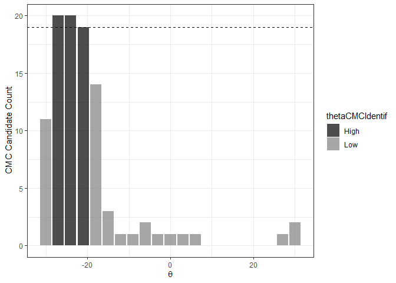

<!-- README.md is generated from README.Rmd. Please edit that file -->

# cmcR

<!-- badges: start -->

[](https://codecov.io/gh/CSAFE-ISU/cmcR?branch=master)
[](https://travis-ci.com/CSAFE-ISU/cmcR)
[](https://github.com/CSAFE-ISU/cmcR/actions)
<!-- badges: end -->

The cmcR package provides an open-source implementation of the Congruent
Matching Cells method for cartridge case identification as proposed by
[Song
(2013)](https://tsapps.nist.gov/publication/get_pdf.cfm?pub_id=911193)
as well as the “High CMC” method proposed by [Tong et
al. (2015)](https://www.ncbi.nlm.nih.gov/pmc/articles/PMC4730689/pdf/jres.120.008.pdf).

## Installation

<!-- You can install the released version of cmcR from [CRAN](https://CRAN.R-project.org) with: -->
<!-- ``` r -->
<!-- install.packages("cmcR") -->
<!-- ``` -->

Install the development version from
[GitHub](https://github.com/CSAFE-ISU/cmcR) with:

``` r
# install.packages("devtools")
devtools::install_github("jzemmels/cmcR")
```

Cartridge case scan data can be accessed at the [NIST Ballisitics
Toolmark Research
Database](https://tsapps.nist.gov/NRBTD/Studies/Search)

## Example

We will illustrate the package’s functionality here. Please refer to the
package vignettes available under the “Articles” tab of the [package
website](https://csafe-isu.github.io/cmcR/index.html) for more
information.

``` r
library(cmcR)
library(magrittr)
library(dplyr)
#> 
#> Attaching package: 'dplyr'
#> The following objects are masked from 'package:stats':
#> 
#>     filter, lag
#> The following objects are masked from 'package:base':
#> 
#>     intersect, setdiff, setequal, union
library(ggplot2)
library(x3ptools)
```

Consider the known match cartridge case pair Fadul 1-1 and Fadul 1-2.
The `read_x3p` function from the
[x3ptools](https://github.com/heike/x3ptools) package can read scans
from the [NBTRD](https://tsapps.nist.gov/NRBTD/Studies/Search) given the
appropriate address. The two scans are read below and visualized using
the
[`x3pListPlot`](https://csafe-isu.github.io/cmcR/reference/x3pListPlot.html)
function.

``` r
fadul1.1_id <- "DownloadMeasurement/2d9cc51f-6f66-40a0-973a-a9292dbee36d"
# Same source comparison
fadul1.2_id <- "DownloadMeasurement/cb296c98-39f5-46eb-abff-320a2f5568e8"

# Code to download breech face impressions:
nbtrd_url <- "https://tsapps.nist.gov/NRBTD/Studies/CartridgeMeasurement/"

fadul1.1_raw <- x3p_read(paste0(nbtrd_url,fadul1.1_id))
fadul1.2_raw <- x3p_read(paste0(nbtrd_url,fadul1.2_id))

x3pListPlot(list("Fadul 1-1" = fadul1.1_raw,
                 "Fadul 1-2" = fadul1.2_raw),
            type = "faceted")
```


### Preprocessing

To perform a proper comparison of these two cartridge cases, we need to
remove regions that do not come into uniform or consistent contact with
the breech face of the firearm. These include the small clusters of
pixels in the corners of the two scans from the microscope staging area,
and the plateaued region of points around the firing pin impression hole
near the center of the scan. A variety of processing procedures are
implemented in the cmcR package. Functions of the form `preProcess_*`
perform the preprocessing procedures. See the [funtion
reference](https://csafe-isu.github.io/cmcR/reference/index.html) of the
cmcR package for more information regarding these procedures. As is
commonly done when comparing cartridge cases, we downsample each scan
(by a factor of 4, selecting every other row/column) using the
`sample_x3p` function.

``` r
fadul1.1_processed <- fadul1.1_raw %>%
  preProcess_crop(region = "exterior",
                  radiusOffset = -30) %>%
  preProcess_crop(region = "interior",
                  radiusOffset = 200) %>%
  preProcess_removeTrend(statistic = "quantile",
                                 tau = .5,
                                 method = "fn") %>%
  preProcess_gaussFilter() %>%
  x3ptools::sample_x3p()

fadul1.2_processed <- fadul1.2_raw  %>%
  preProcess_crop(region = "exterior",
                  radiusOffset = -30) %>%
  preProcess_crop(region = "interior",
                  radiusOffset = 200) %>%
  preProcess_removeTrend(statistic = "quantile",
                                 tau = .5,
                                 method = "fn") %>%
  preProcess_gaussFilter() %>%
  x3ptools::sample_x3p()

processedScans <- x3pListPlot(list("Processed Fadul 1-1" = fadul1.1_processed,
                                   "Processed Fadul1-2" = fadul1.2_processed),
                              type = "faceted")

processedScans
```


### Cell-based comparison procedure

Functions of the form `comparison_*` perform the steps of the cell-based
comparison procedure. The data generated from the cell-based comparison
procedure are kept in a [`tibble`](https://tibble.tidyverse.org/) where
one row represents a single cell/region pairing.

The `comparison_cellDivision` function divides a scan up into a grid of
cells. The `cellIndex` column represents the `row,col` location in the
original scan each cell inhabits. Each cell is stored as an `.x3p`
object in the `cellHeightValues` column. The benefit of using a `tibble`
structure is that processes such as removing rows can be accomplished
using simple `dplyr` commands such as `filter`.

``` r
cellTibble <- fadul1.1_processed %>%
  comparison_cellDivision(numCells = 64)

cellTibble
#> # A tibble: 64 x 2
#>    cellIndex cellHeightValues
#>    <chr>     <named list>    
#>  1 8, 1      <x3p>           
#>  2 8, 2      <x3p>           
#>  3 8, 3      <x3p>           
#>  4 8, 4      <x3p>           
#>  5 8, 5      <x3p>           
#>  6 8, 6      <x3p>           
#>  7 8, 7      <x3p>           
#>  8 8, 8      <x3p>           
#>  9 7, 1      <x3p>           
#> 10 7, 2      <x3p>           
#> # ... with 54 more rows
```

The `comparison_getTargetRegions` function extracts a region from a
target scan (in this case Fadul 1-2) to be paired with each cell in the
reference scan.

``` r
cellTibble <- cellTibble %>%
  mutate(regionHeightValues = comparison_getTargetRegions(cellHeightValues = cellHeightValues,
                                                          target = fadul1.2_processed))

cellTibble
#> # A tibble: 64 x 3
#>    cellIndex cellHeightValues regionHeightValues
#>    <chr>     <named list>     <named list>      
#>  1 8, 1      <x3p>            <x3p>             
#>  2 8, 2      <x3p>            <x3p>             
#>  3 8, 3      <x3p>            <x3p>             
#>  4 8, 4      <x3p>            <x3p>             
#>  5 8, 5      <x3p>            <x3p>             
#>  6 8, 6      <x3p>            <x3p>             
#>  7 8, 7      <x3p>            <x3p>             
#>  8 8, 8      <x3p>            <x3p>             
#>  9 7, 1      <x3p>            <x3p>             
#> 10 7, 2      <x3p>            <x3p>             
#> # ... with 54 more rows
```

We want to exclude cells and regions that are mostly missing from the
scan. The `comparison_calcPropMissing` function calculates the
proportion of missing values in a surface matrix. The call below
excludes rows in which either the cell or region contain more that 85%
missing values.

``` r
cellTibble <- cellTibble %>%
  mutate(cellPropMissing = comparison_calcPropMissing(cellHeightValues),
         regionPropMissing = comparison_calcPropMissing(regionHeightValues)) %>%
  filter(cellPropMissing <= .85 & regionPropMissing <= .85)

cellTibble %>%
  select(cellIndex,cellPropMissing,regionPropMissing)
#> # A tibble: 25 x 3
#>    cellIndex cellPropMissing regionPropMissing
#>    <chr>               <dbl>             <dbl>
#>  1 8, 6               0.833              0.808
#>  2 7, 7               0.657              0.700
#>  3 7, 8               0.834              0.757
#>  4 6, 8               0.353              0.638
#>  5 5, 8               0.153              0.576
#>  6 4, 1               0.117              0.767
#>  7 4, 8               0.0441             0.511
#>  8 3, 1               0.305              0.687
#>  9 3, 2               0.368              0.605
#> 10 3, 7               0.243              0.390
#> # ... with 15 more rows
```

We can standardize the surface matrix height values by centering/scaling
by desired functions (e.g., mean and standard deviation). Also, to apply
frequency-domain techniques in comparing each cell and region, the
missing values in each scan need to be replaced. These operations are
performed in the `comparison_standardizeHeightValues` and
`comparison_replaceMissingValues` functions.

Then, the `comparison_fft_ccf` function estimates the translations
required to align the cell and region using the [Cross-Correlation
Theorem](https://mathworld.wolfram.com/Cross-CorrelationTheorem.html).
The `comparison_fft_ccf` function returns a data frame of 3 `x`, `y`,
and `fft_ccf` values: the *x*, *y* estimated translation values at which
the CCF<sub>max</sub> value is attained between the cell and region. The
`tidyr::unnest` function can unpack the data frame into 3 separate
columns, if desired.

``` r
cellTibble <- cellTibble  %>%
  mutate(cellHeightValues = comparison_standardizeHeights(cellHeightValues),
         regionHeightValues = comparison_standardizeHeights(regionHeightValues)) %>%
  mutate(cellHeightValues_replaced = comparison_replaceMissing(cellHeightValues),
         regionHeightValues_replaced = comparison_replaceMissing(regionHeightValues)) %>%
  mutate(fft_ccf_df = comparison_fft_ccf(cellHeightValues = cellHeightValues_replaced,
                                         regionHeightValues = regionHeightValues_replaced))

cellTibble %>%
  tidyr::unnest(cols = fft_ccf_df) %>%
  select(cellIndex,fft_ccf,x,y)
#> # A tibble: 25 x 4
#>    cellIndex fft_ccf     x     y
#>    <chr>       <dbl> <dbl> <dbl>
#>  1 8, 6        0.241    -7   -23
#>  2 7, 7        0.186    55    31
#>  3 7, 8        0.191    53    53
#>  4 6, 8        0.166   -23   -60
#>  5 5, 8        0.175    -3    13
#>  6 4, 1        0.209   -14   -48
#>  7 4, 8        0.154     8   -48
#>  8 3, 1        0.323   -53   -79
#>  9 3, 2        0.284     8   -45
#> 10 3, 7        0.167    13   -85
#> # ... with 15 more rows
```

Because so many missing values need to be replaced, the
CCF<sub>max</sub> value calculated in the `fft_ccf` column using
frequency-domain techniques is not a very good similarity score (doesn’t
differentiate matches from non-matches well). However, the `x` and `y`
estimated translations are good estimates of the “true” translation
values needed to align the cell and region. To calculate a more accurate
similarity score, we can use the pairwise-complete correlation in which
only pairs of non-missing pixels are considered in the correlation
calculation. This provides a better similarity metric. The
pairwise-complete correlation can be calculated with the
`comparison_cor` function.

``` r
cellTibble %>%
  mutate(pairwiseCompCor = comparison_cor(cellHeightValues,regionHeightValues,fft_ccf_df)) %>%
  tidyr::unnest(fft_ccf_df) %>%
  select(cellIndex,x,y,pairwiseCompCor)
#> # A tibble: 25 x 4
#>    cellIndex     x     y pairwiseCompCor
#>    <chr>     <dbl> <dbl>           <dbl>
#>  1 8, 6         -7   -23           0.509
#>  2 7, 7         55    31           0.331
#>  3 7, 8         53    53           0.490
#>  4 6, 8        -23   -60           0.345
#>  5 5, 8         -3    13           0.368
#>  6 4, 1        -14   -48           0.417
#>  7 4, 8          8   -48           0.276
#>  8 3, 1        -53   -79           0.608
#>  9 3, 2          8   -45           0.585
#> 10 3, 7         13   -85           0.450
#> # ... with 15 more rows
```

Finally, this entire comparison procedure is to be repeated over a
number of rotations of the target scan. The entire cell-based comparison
procedure is wrapped in the `comparison_allTogether` function. The
resulting data frame below contains the features that are used in the
decision-rule procedure

``` r
kmComparisonFeatures <- purrr::map_dfr(seq(-30,30,by = 3),
                                       ~ comparison_allTogether(reference = fadul1.1_processed,
                                                                target = fadul1.2_processed,
                                                                
                                                                theta = .))

kmComparisonFeatures
#> # A tibble: 527 x 6
#>    cellIndex     x     y fft_ccf pairwiseCompCor theta
#>    <chr>     <dbl> <dbl>   <dbl>           <dbl> <dbl>
#>  1 7, 7        -28   -53   0.198           0.324   -30
#>  2 6, 1        -21    37   0.409           0.732   -30
#>  3 6, 8        -17   -22   0.253           0.507   -30
#>  4 5, 1         -9    35   0.284           0.673   -30
#>  5 5, 8         -8   -26   0.230           0.535   -30
#>  6 4, 1          0    34   0.293           0.610   -30
#>  7 4, 8          0   -22   0.217           0.518   -30
#>  8 3, 1          8    33   0.433           0.761   -30
#>  9 3, 2         65    66   0.278           0.529   -30
#> 10 3, 7          7   -12   0.135           0.340   -30
#> # ... with 517 more rows
```

### Decision rule

The decision rules described in [Song
(2013)](https://tsapps.nist.gov/publication/get_pdf.cfm?pub_id=911193)
and [Tong et
al. (2015)](https://www.ncbi.nlm.nih.gov/pmc/articles/PMC4730689/pdf/jres.120.008.pdf)
are implemented via the `decision_*` functions. The two decision rules
are referred to as the original method of [Song
(2013)](https://tsapps.nist.gov/publication/get_pdf.cfm?pub_id=911193)
and the High CMC method, respectively. Considering the
`kmComparisonFeatures` data frame returned above, we can interpret both
of these decision rules as logic that separates “aberrant” from
“homogeneous” similarity features. The two decision rules principally
differ in how they define an homogeneity.

The original method of [Song
(2013)](https://tsapps.nist.gov/publication/get_pdf.cfm?pub_id=911193)
considers only the similarity features at which the maximum correlation
is attained for each cell across all rotations considered. Since there
is ambiguity in exactly how the correlation is computed in the original
methods, we will consider the features at which specifically the maximum
`pairwiseCompCor` is attained (instead of using the `fft_ccf` column).

``` r
kmComparisonFeatures %>%
  group_by(cellIndex) %>%
  top_n(n = 1,wt = pairwiseCompCor)
#> # A tibble: 27 x 6
#> # Groups:   cellIndex [27]
#>    cellIndex     x     y fft_ccf pairwiseCompCor theta
#>    <chr>     <dbl> <dbl>   <dbl>           <dbl> <dbl>
#>  1 3, 8          6   -18   0.306           0.631   -30
#>  2 2, 1         17     9   0.202           0.829   -30
#>  3 2, 4         16    11   0.204           0.620   -30
#>  4 2, 5         16     5   0.194           0.542   -30
#>  5 1, 5         21     4   0.229           0.527   -30
#>  6 5, 1         -6    23   0.333           0.720   -27
#>  7 5, 8         -8   -12   0.244           0.602   -27
#>  8 3, 1          3    22   0.439           0.782   -27
#>  9 2, 2          5    18   0.252           0.697   -27
#> 10 2, 7          6    -7   0.351           0.721   -27
#> # ... with 17 more rows
```

The above set of features can be thought of as the `x`, `y`, and `theta`
“votes” that each cell most strongly “believes” to be the correct
alignment of the entire scan. If a pair is truly matching, we would
expect many of these votes to be similar to each other; indicating that
there is an approximate consensus of the true alignment of the entire
scan (at least, this is the assumption made in [Song
(2013)](https://tsapps.nist.gov/publication/get_pdf.cfm?pub_id=911193)).
In [Song
(2013)](https://tsapps.nist.gov/publication/get_pdf.cfm?pub_id=911193),
the consensus is defined to be the median of the `x`, `y`, and `theta`
values in this `topVotesPerCell` data frame. Cells that are deemed
“close” to these consensus values and that have a “large” correlation
value are declared Congruent Matching Cells (CMCs). Cells with `x`, `y`,
and `theta` values that are within user-defined *T*<sub>*x*</sub>,
*T*<sub>*y*</sub>, and *T*<sub>*θ*</sub> thresholds of the consensus
`x`, `y`, and `theta` values are considered “close.” If these cells also
have a correlation greater than a user-defined *T*<sub>CCF</sub>
threshold, then they are considered CMCs. Note that these thresholds are
chosen entirely by experimentation in the CMC literature.

``` r
kmComparison_originalCMCs <- kmComparisonFeatures %>%
  mutate(originalMethodClassif = decision_CMC(cellIndex = cellIndex,
                                              x = x,
                                              y = y,
                                              theta = theta,
                                              corr = pairwiseCompCor,
                                              xThresh = 20,
                                              yThresh = 20,
                                              thetaThresh = 6,
                                              corrThresh = .5))

kmComparison_originalCMCs %>%
  filter(originalMethodClassif == "CMC")
#> # A tibble: 17 x 7
#>    cellIndex     x     y fft_ccf pairwiseCompCor theta originalMethodClassif
#>    <chr>     <dbl> <dbl>   <dbl>           <dbl> <dbl> <chr>                
#>  1 2, 1         17     9   0.202           0.829   -30 CMC                  
#>  2 2, 4         16    11   0.204           0.620   -30 CMC                  
#>  3 2, 5         16     5   0.194           0.542   -30 CMC                  
#>  4 1, 5         21     4   0.229           0.527   -30 CMC                  
#>  5 5, 1         -6    23   0.333           0.720   -27 CMC                  
#>  6 5, 8         -8   -12   0.244           0.602   -27 CMC                  
#>  7 3, 1          3    22   0.439           0.782   -27 CMC                  
#>  8 2, 2          5    18   0.252           0.697   -27 CMC                  
#>  9 2, 7          6    -7   0.351           0.721   -27 CMC                  
#> 10 6, 8         -8     4   0.273           0.609   -24 CMC                  
#> 11 3, 2         -2     9   0.294           0.793   -24 CMC                  
#> 12 2, 3         -1     6   0.195           0.664   -24 CMC                  
#> 13 1, 3         -1    11   0.295           0.673   -24 CMC                  
#> 14 4, 1         -4    -2   0.360           0.730   -21 CMC                  
#> 15 4, 8         -7    14   0.257           0.644   -21 CMC                  
#> 16 1, 6        -13    12   0.296           0.676   -21 CMC                  
#> 17 6, 1          7    -9   0.513           0.777   -18 CMC
```

One criticism of the original method of [Song
(2013)](https://tsapps.nist.gov/publication/get_pdf.cfm?pub_id=911193)
is that many cell/region pairs exhibit high correlation values at a
number of rotations. In particular, a cell/region pair may attain a very
high correlation at the “true” theta value, yet attain its maximum
correlation at a theta value far from the consensus theta value. The
original method of [Song
(2013)](https://tsapps.nist.gov/publication/get_pdf.cfm?pub_id=911193)
only considers the “top” vote of each cell/region pairing, so it is not
sensitive to how that cell/region pairing behaves across multiple
rotations.

[Tong et
al. (2015)](https://www.ncbi.nlm.nih.gov/pmc/articles/PMC4730689/pdf/jres.120.008.pdf)
propose a different decision rule procedure that considers the behavior
of cell/region pairings across multiple rotations. This method would
come to be called the High CMC method. The procedure involves computing
a “CMC-`theta`” distribution where for each value of `theta`, the `x`
and `y` values are compared to consensus `x` and `y` values (again, the
median) and the correlation values to a minimum threshold. A cell is
considered a “CMC candidate” (our language, not theirs) at a particular
`theta` value if its `x` and `y` values are within *T*<sub>*x*</sub>,
*T*<sub>*y*</sub> thresholds of the consensus `x` and `y` values and the
correlation is at least as larges as the *T*<sub>CCF</sub> threshold.
This is similar to the original method of [Song
(2013)](https://tsapps.nist.gov/publication/get_pdf.cfm?pub_id=911193)
except that it relaxes the requirement that the top `theta` value be
close to a consensus. Continuing with the voting analogy, think of this
as an [approval voting
system](https://en.wikipedia.org/wiki/Approval_voting) where each cell
is allowed to vote for multiple `theta` values as long as the `x` and
`y` votes are deemed close to the `theta`-specific `x`,`y` consensuses
and the correlation values are sufficiently high.

The CMC-`theta` distribution consists of the “CMC candidates” at each
value of `theta`. The assumption made in [Tong et
al. (2015)](https://www.ncbi.nlm.nih.gov/pmc/articles/PMC4730689/pdf/jres.120.008.pdf)
is that, for a truly matching cartridge case pair, a large number of CMC
candidates should be concentrated around true `theta` alignment value.
In their words, the CMC-`theta` distribution should exhibit a “prominent
peak” close to the rotation at which the two cartridge cases actually
align. Such a prominent peak should not occur for a non-match cartridge
case pair.

The figure below shows an example of a CMC-`theta` distribution between
Fadul 1-1 and Fadul 1-2 constructed using the
`decision_highCMC_cmcThetaDistrib` function. We can clearly see that a
mode is attained around -27 to -24 degrees.

``` r
kmComparisonFeatures %>%
  mutate(cmcThetaDistribClassif = decision_highCMC_cmcThetaDistrib(cellIndex = cellIndex,
                                                                   x = x,
                                                                   y = y,
                                                                   theta = theta,
                                                                   corr = pairwiseCompCor,
                                                                   xThresh = 20,
                                                                   yThresh = 20,
                                                                   corrThresh = .5)) %>%
  filter(cmcThetaDistribClassif == "CMC Candidate") %>%
  ggplot(aes(x = theta)) +
  geom_bar(stat = "count",
           alpha = .7) +
  theme_bw() +
  ylab("CMC Candidate Count") +
  xlab(expression(theta))
```


The next step of the High CMC method is to automatically determine if a
mode (i.e., a “prominent peak”) exists in a CMC-`theta` distribution. If
we find a mode, then there is evidence that a “true” rotation exists to
align the two cartridge cases implying the cartridge cases must be
matches (such is the logic employed in [Tong et
al. (2015)](https://www.ncbi.nlm.nih.gov/pmc/articles/PMC4730689/pdf/jres.120.008.pdf)).
To automatically identify a mode, [Tong et
al. (2015)](https://www.ncbi.nlm.nih.gov/pmc/articles/PMC4730689/pdf/jres.120.008.pdf)
propose determining the range of `theta` values with “high” CMC
candidate counts (if this range is small, then there is likely a mode).
They define a “high” CMC candidate count to be
*C**M**C*<sub>high</sub> ≡ *C**M**C*<sub>max</sub> − *τ* where
*C**M**C*<sub>max</sub> is the maximum value attained in the CMC-`theta`
distribution (17 in the plot shown above) and *τ* is a user-defined
constant ([Tong et
al. (2015)](https://www.ncbi.nlm.nih.gov/pmc/articles/PMC4730689/pdf/jres.120.008.pdf)
use *τ* = 1). Any `theta` value with associated an associated CMC
candidate count at least as large as *C**M**C*<sub>high</sub> have a
“high” CMC candidate count while any others have a “low” CMC candidate
count.

The figure below shows the classification of `theta` values into “High”
and “Low” CMC candidate count groups using the
`decision_highCMC_identifyHighCMCThetas` function. The High CMC count
threshold is shown as a dashed line at 17 − 1 CMCs. As expected since
this cartridge case pair is a match, the High CMC count `theta` values
are all close to each other.

``` r
kmComparisonFeatures %>%
  mutate(cmcThetaDistribClassif = decision_highCMC_cmcThetaDistrib(cellIndex = cellIndex,
                                                                   x = x,
                                                                   y = y,
                                                                   theta = theta,
                                                                   corr = pairwiseCompCor,
                                                                   xThresh = 20,
                                                                   yThresh = 20,
                                                                   corrThresh = .5)) %>%
  decision_highCMC_identifyHighCMCThetas(tau = 1) %>%
  filter(cmcThetaDistribClassif == "CMC Candidate") %>%
  ggplot() +
  geom_bar(aes(x = theta, fill = thetaCMCIdentif),
           stat = "count",
           alpha = .7) +
  geom_hline(aes(yintercept = max(cmcCandidateCount) - 1),
             linetype = "dashed") +
  scale_fill_manual(values = c("black","gray50")) +
  theme_bw() +
  ylab("CMC Candidate Count") +
  xlab(expression(theta))
```



If the range of High CMC count `theta` values is less than the
user-defined *T*<sub>*θ*</sub> threshold, then [Tong et
al. (2015)](https://www.ncbi.nlm.nih.gov/pmc/articles/PMC4730689/pdf/jres.120.008.pdf)
classify all CMC candidates in the identified `theta` mode as actual
CMCs.

The `decision_CMC` function classifies CMCs based on this High CMC
criterion if a value for `tau` is given. Note that it internally calls
the `decision_highCMC_cmcThetaDistrib` and
`decision_highCMC_identifyHighCMCThetas` functions (although they are
exported as diagnostic tools). A cell may be counted as a CMC for
multiple `theta` values. In these cases, we will only consider the
alignment values at which the cell attained its maximum CCF and was
classified as a CMC. If the cartridge case pair “fails” the High CMC
criterion (i.e., the range of High CMC candidate `theta` values is
deemed too large), every cell will be classified as “non-CMC (failed)”
under the High CMC method. When it comes to combining the CMCs from two
comparison directions (cartridge case A vs. B and B vs. A), we must
treat a cell classified as a non-CMC because the High CMC criterion
failed differently from a cell classified as a non-CMC for which the
High CMC criterion passed.
<!-- [Tong et al. (2015)](https://www.ncbi.nlm.nih.gov/pmc/articles/PMC4730689/pdf/jres.120.008.pdf) propose using the CMC count determined under the original method of [Song (2013)](https://tsapps.nist.gov/publication/get_pdf.cfm?pub_id=911193) as a backup CMC count. -->

``` r
kmComparison_highCMCs <- kmComparisonFeatures %>%
  mutate(highCMCClassif = decision_CMC(cellIndex = cellIndex,
                                       x = x,
                                       y = y,
                                       theta = theta,
                                       corr = pairwiseCompCor,
                                       xThresh = 20,
                                       yThresh = 20,
                                       thetaThresh = 6,
                                       corrThresh = .5,
                                       tau = 1))
#Example of cells classified as CMCs and non-CMCs
kmComparison_highCMCs %>%
  slice(21:35)
#> # A tibble: 15 x 7
#>    cellIndex     x     y fft_ccf pairwiseCompCor theta highCMCClassif  
#>    <chr>     <dbl> <dbl>   <dbl>           <dbl> <dbl> <chr>           
#>  1 1, 3         20    23   0.314           0.671   -30 non-CMC (passed)
#>  2 1, 4         21    13   0.221           0.576   -30 non-CMC (passed)
#>  3 1, 5         21     4   0.229           0.527   -30 non-CMC (passed)
#>  4 1, 6         22     1   0.228           0.547   -30 non-CMC (passed)
#>  5 1, 7         22   -14   0.339           0.856   -30 non-CMC (passed)
#>  6 7, 7        -22   -43   0.214           0.364   -27 non-CMC (passed)
#>  7 7, 8          3   -55   0.202           0.471   -27 non-CMC (passed)
#>  8 6, 1        -13    26   0.436           0.760   -27 CMC             
#>  9 6, 8        -13    -9   0.268           0.577   -27 non-CMC (passed)
#> 10 5, 1         -6    23   0.333           0.720   -27 CMC             
#> 11 5, 8         -8   -12   0.244           0.602   -27 CMC             
#> 12 4, 1         -1    23   0.341           0.676   -27 non-CMC (passed)
#> 13 4, 8         -3   -10   0.239           0.578   -27 non-CMC (passed)
#> 14 3, 1          3    22   0.439           0.782   -27 CMC             
#> 15 3, 2         62    54   0.286           0.548   -27 non-CMC (passed)
```

In summary: the `decison_CMC` function applies either the decision rules
of the original method of [Song
(2013)](https://tsapps.nist.gov/publication/get_pdf.cfm?pub_id=911193)
or the High CMC method of [Tong et
al. (2015)](https://www.ncbi.nlm.nih.gov/pmc/articles/PMC4730689/pdf/jres.120.008.pdf),
depending on whether the user specifies a value for the High CMC
threshold `tau`.

``` r
kmComparison_allCMCs <- kmComparisonFeatures %>%
  mutate(originalMethodClassif = decision_CMC(cellIndex = cellIndex,
                                              x = x,
                                              y = y,
                                              theta = theta,
                                              corr = pairwiseCompCor,
                                              xThresh = 20,
                                              thetaThresh = 6,
                                              corrThresh = .5),
         highCMCClassif = decision_CMC(cellIndex = cellIndex,
                                              x = x,
                                              y = y,
                                              theta = theta,
                                              corr = pairwiseCompCor,
                                              xThresh = 20,
                                              thetaThresh = 6,
                                              corrThresh = .5,
                                              tau = 1))

#Example of cells classified as CMC under 1 decision rule but not the other.
kmComparison_allCMCs %>%
  slice(21:35)
#> # A tibble: 15 x 8
#>    cellIndex     x     y fft_ccf pairwiseCompCor theta originalMethodC~
#>    <chr>     <dbl> <dbl>   <dbl>           <dbl> <dbl> <chr>           
#>  1 1, 3         20    23   0.314           0.671   -30 non-CMC         
#>  2 1, 4         21    13   0.221           0.576   -30 non-CMC         
#>  3 1, 5         21     4   0.229           0.527   -30 CMC             
#>  4 1, 6         22     1   0.228           0.547   -30 non-CMC         
#>  5 1, 7         22   -14   0.339           0.856   -30 non-CMC         
#>  6 7, 7        -22   -43   0.214           0.364   -27 non-CMC         
#>  7 7, 8          3   -55   0.202           0.471   -27 non-CMC         
#>  8 6, 1        -13    26   0.436           0.760   -27 non-CMC         
#>  9 6, 8        -13    -9   0.268           0.577   -27 non-CMC         
#> 10 5, 1         -6    23   0.333           0.720   -27 CMC             
#> 11 5, 8         -8   -12   0.244           0.602   -27 CMC             
#> 12 4, 1         -1    23   0.341           0.676   -27 non-CMC         
#> 13 4, 8         -3   -10   0.239           0.578   -27 non-CMC         
#> 14 3, 1          3    22   0.439           0.782   -27 CMC             
#> 15 3, 2         62    54   0.286           0.548   -27 non-CMC         
#> # ... with 1 more variable: highCMCClassif <chr>
```

The set of CMCs computed above are based on assuming Fadul 1-1 as the
reference scan and Fadul 1-2 as the target scan. [Tong et
al. (2015)](https://www.ncbi.nlm.nih.gov/pmc/articles/PMC4730689/pdf/jres.120.008.pdf)
propose performing the cell-based comparison and decision rule
procedures with the roles reversed and combining the results. They
indicate that if the High CMC method fails to identify a `theta` mode in
the CMC-`theta` distribution, then the minimum of the two CMC counts
computed under the original method of [Song
(2013)](https://tsapps.nist.gov/publication/get_pdf.cfm?pub_id=911193)
should be used as the CMC count (although they don’t detail how to
proceed if a `theta` mode is identified in only one of the two
comparisons).

``` r
#Compare using Fadul 1-2 as reference and Fadul 1-1 as target
kmComparisonFeatures_rev <- purrr::map_dfr(seq(-30,30,by = 3),
                                           ~ comparison_allTogether(reference = fadul1.2_processed,
                                                                    target = fadul1.1_processed,
                                                                    theta = .))

kmComparison_allCMCs_rev <- kmComparisonFeatures_rev %>%
  mutate(originalMethodClassif = decision_CMC(cellIndex = cellIndex,
                                              x = x,
                                              y = y,
                                              theta = theta,
                                              corr = pairwiseCompCor,
                                              xThresh = 20,
                                              thetaThresh = 6,
                                              corrThresh = .5),
         highCMCClassif = decision_CMC(cellIndex = cellIndex,
                                              x = x,
                                              y = y,
                                              theta = theta,
                                              corr = pairwiseCompCor,
                                              xThresh = 20,
                                              thetaThresh = 6,
                                              corrThresh = .5,
                                              tau = 1))
```

The logic required to combine the results in `kmComparison_allCMCs` and
`kmComparison_allCMCs_rev` can get a little complicated (although
entirely doable using `dplyr` and other `tidyverse` functions). The user
must decide precisely how results from both directions are to be
combined. For example, if one direction fails the High CMC criterion yet
the other passes, should we treat this as if *both* directions failed?
Will you only count the CMCs in the direction that passed? We have found
the best option to be treating a failure in one direction as a failure
in both directions – such cartridge case pairs would then be assigned
the minimum of the two CMC counts determined under the original method
of [Song
(2013)](https://tsapps.nist.gov/publication/get_pdf.cfm?pub_id=911193).
The `decision_combineDirections` function implements the logic to
combine the two sets of results, assuming the data frame contains
columns named `originalMethodClassif` and `highCMCClassif` (as defined
above).

``` r
decision_combineDirections(kmComparison_allCMCs,
                           kmComparison_allCMCs_rev)
#> $originalMethodCMCs
#> $originalMethodCMCs[[1]]
#> # A tibble: 17 x 7
#>    cellIndex     x     y fft_ccf pairwiseCompCor theta direction         
#>    <chr>     <dbl> <dbl>   <dbl>           <dbl> <dbl> <chr>             
#>  1 2, 1         17     9   0.202           0.829   -30 reference_v_target
#>  2 2, 4         16    11   0.204           0.620   -30 reference_v_target
#>  3 2, 5         16     5   0.194           0.542   -30 reference_v_target
#>  4 1, 5         21     4   0.229           0.527   -30 reference_v_target
#>  5 5, 1         -6    23   0.333           0.720   -27 reference_v_target
#>  6 5, 8         -8   -12   0.244           0.602   -27 reference_v_target
#>  7 3, 1          3    22   0.439           0.782   -27 reference_v_target
#>  8 2, 2          5    18   0.252           0.697   -27 reference_v_target
#>  9 2, 7          6    -7   0.351           0.721   -27 reference_v_target
#> 10 6, 8         -8     4   0.273           0.609   -24 reference_v_target
#> 11 3, 2         -2     9   0.294           0.793   -24 reference_v_target
#> 12 2, 3         -1     6   0.195           0.664   -24 reference_v_target
#> 13 1, 3         -1    11   0.295           0.673   -24 reference_v_target
#> 14 4, 1         -4    -2   0.360           0.730   -21 reference_v_target
#> 15 4, 8         -7    14   0.257           0.644   -21 reference_v_target
#> 16 1, 6        -13    12   0.296           0.676   -21 reference_v_target
#> 17 6, 1          7    -9   0.513           0.777   -18 reference_v_target
#> 
#> $originalMethodCMCs[[2]]
#> # A tibble: 18 x 7
#>    cellIndex     x     y fft_ccf pairwiseCompCor theta direction         
#>    <chr>     <dbl> <dbl>   <dbl>           <dbl> <dbl> <chr>             
#>  1 5, 1         -1    12   0.530           0.825    18 target_v_reference
#>  2 7, 7         -5   -16   0.262           0.610    21 target_v_reference
#>  3 4, 1          2    -1   0.338           0.810    21 target_v_reference
#>  4 4, 8          7   -19   0.388           0.651    21 target_v_reference
#>  5 3, 1          6     1   0.329           0.833    21 target_v_reference
#>  6 2, 2          8    -2   0.460           0.776    21 target_v_reference
#>  7 7, 8          5    -3   0.250           0.691    24 target_v_reference
#>  8 6, 8          4    -4   0.297           0.639    24 target_v_reference
#>  9 5, 8          2    -6   0.378           0.761    24 target_v_reference
#> 10 3, 2          0   -10   0.218           0.716    24 target_v_reference
#> 11 3, 6         -5    -8   0.277           0.695    24 target_v_reference
#> 12 2, 3         -1   -10   0.358           0.827    24 target_v_reference
#> 13 2, 7         -3    -7   0.248           0.604    24 target_v_reference
#> 14 1, 4         -3    -5   0.264           0.644    24 target_v_reference
#> 15 3, 8         -4    10   0.444           0.783    27 target_v_reference
#> 16 2, 5        -11    -3   0.281           0.680    27 target_v_reference
#> 17 2, 6         -9     1   0.223           0.652    27 target_v_reference
#> 18 1, 5        -15    -1   0.326           0.613    27 target_v_reference
#> 
#> 
#> $highCMCs
#> # A tibble: 24 x 7
#>    cellIndex     x     y fft_ccf pairwiseCompCor theta direction         
#>    <chr>     <dbl> <dbl>   <dbl>           <dbl> <dbl> <chr>             
#>  1 6, 1        -13    26   0.436           0.760   -27 reference_v_target
#>  2 5, 1         -6    23   0.333           0.720   -27 reference_v_target
#>  3 2, 7          6    -7   0.351           0.721   -27 reference_v_target
#>  4 3, 2         -2     9   0.294           0.793   -24 reference_v_target
#>  5 2, 4         -3     8   0.200           0.595   -24 reference_v_target
#>  6 1, 3         -1    11   0.295           0.673   -24 reference_v_target
#>  7 1, 6         -1     7   0.294           0.658   -24 reference_v_target
#>  8 1, 7         -1     0   0.362           0.880   -24 reference_v_target
#>  9 7, 7         -5   -16   0.262           0.610    21 target_v_reference
#> 10 4, 1          2    -1   0.338           0.810    21 target_v_reference
#> # ... with 14 more rows
```

The final step is to decide whether the number of CMCs computed under
your preferred method is large enough to declare the cartridge case a
match. [Song
(2013)](https://tsapps.nist.gov/publication/get_pdf.cfm?pub_id=911193)
originally proposed using a CMC count equal to 6 as the decision
boundary (i.e., classify “match” if CMC count is greater than or equal
to 6). This has been shown to not generalize to other proposed methods
and data sets (see, e.g., [Chen et
al. (2017)](https://www.sciencedirect.com/science/article/pii/S0379073817303420?via%3Dihub)).
A more principled approach to choosing the CMC count has not yet been
described.

Finally, we can visualize the regions of the scan identified as CMCs.

``` r
cmcPlots <- cmcPlot(reference = fadul1.1_processed,
                    target  = fadul1.2_processed,
                    reference_v_target_CMCs = kmComparison_allCMCs,
                    target_v_reference_CMCs = kmComparison_allCMCs_rev,
                    x3pNames = c("Fadul 1-1","Fadul 1-2"))

gridExtra::grid.arrange(cmcPlots[[1]],
                        cmcPlots[[2]],
                        cmcPlots[[3]],
                        cmcPlots[[4]],
                        ncol = 1,
                        nrow = 4)
```


